# Lab 1: コンピュートインタンス・ネットワーク設定等の環境構築

## Key Objectives:

- OCIテナントのホストリソースにコンパートメントを作成する方法を学びます
- インターネット接続を備えた仮想クラウドネットワークを作成する方法を学びます
- MySQLデータベースサービスポートを介したトラフィックを許可するためのセキュリティリストに入力ルールを追加する

## Introduction

コンパートメントは、クラウドリソースを整理して隔離するためのOracle Cloud Infrastructureの基本コンポーネントです。 使用法と請求、アクセス（ポリシーの使用など）、および個別管理（あるプロジェクトまたはビジネスユニットのリソースを別のプロジェクトのリソースを分離する）の目的で、それらを使用するためにそれらを使用します。 

**[Compartment Overview](https://docs.oracle.com/en-us/iaas/Content/GSG/Concepts/settinguptenancy.htm#Understa)**

Virtual Cloud Networkは、次のコンポーネント（サブネット、ルートテーブル、セキュリティリスト、ゲートウェイなど）を定義することによって、Oracle Cloud内で独自のデータセンターネットワークトポロジを定義するのに役立ちます。 これらのコンポーネントの中には、デフォルトでは初期設定が既に存在し、削除できません：
-	ルートルールがないデフォルトのルートテーブル
-	デフォルトのセキュリティルールを持つデフォルトのセキュリティリスト
-	デフォルト値を持つDHCPオプションのデフォルトセット、VCNの概要、許容サイズ、デフォルトのVCNコンポーネント、およびVCNを使用するため詳細のリンク**[Networking Overview](https://docs.oracle.com/en-us/iaas/Content/Network/Concepts/overview.htm#network_landing)**.

セキュリティリストは、インスタンス用の仮想ファイアウォールとして機能し、インプレッシュのトラフィックの種類を指定する入力と出力ルールを使用します。 各サブネットには、複数のセキュリティリストが関連付けられている可能性があり、各リストに複数のルールを持つことができます。 デフォルトのセキュリティリストには、最初のステートフルルールのセットが付属しています。これは、ほとんどの場合、そのVCNまたはサブネットをホストするリージョンに関連する許可されたサブネットからのインバイドサブネットのみを許可するように変更されます。 各地域に関連する承認されたサブネット範囲のリストは**[ここで](https://docs.cloud.oracle.com/iaas/tools/public_ip_ranges.json)**.で見つけることができます。 

## Steps

### **Step 1.1:**
  OCIテナントにログインします。clik on the _**menu icon**_ on the top left corner 
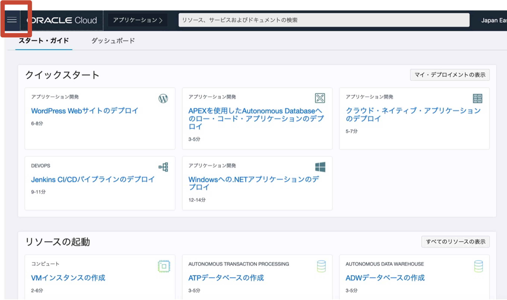

### **Step 1.2:**
  メニューが選択されたら  _**アイデンティティとセキュリティ >> コンパートメント**_
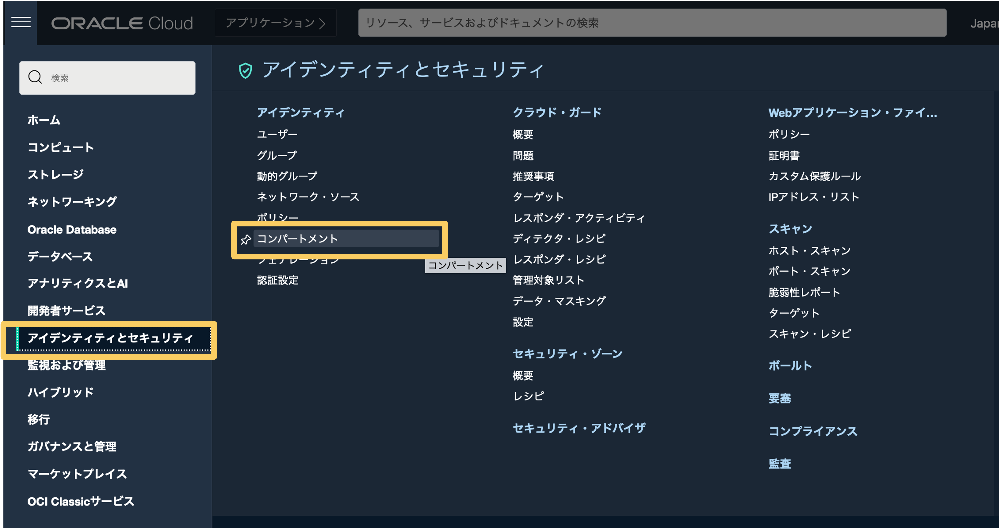

### **Step 1.3:**
  左メニューの_**コンパートメント**_を選択し_**コンパートメントの作成**_をクリック
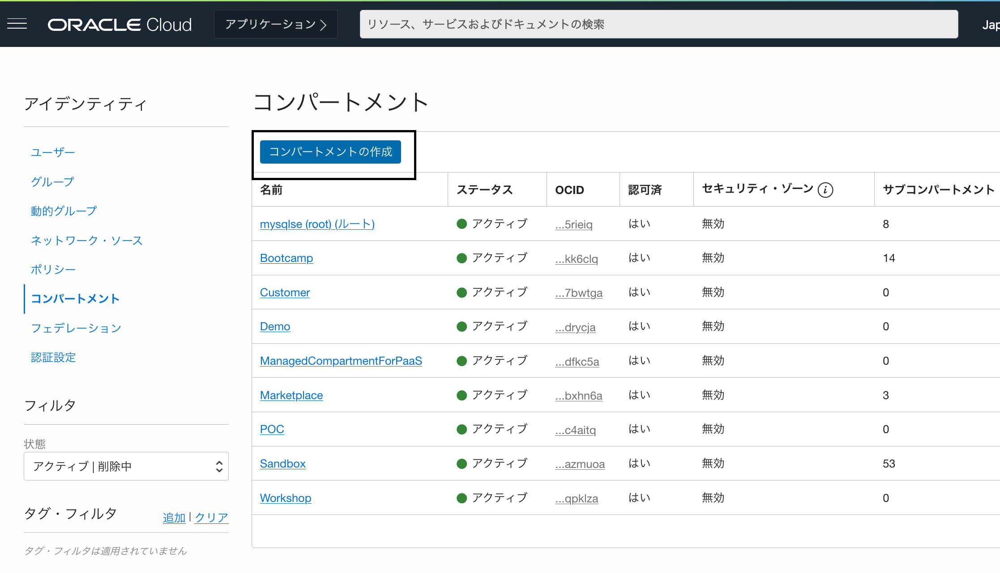

### **Step 1.4:**
  名前と説明の箇所には _**mds-replication-hol**_ を入力し、_**コンパートメントの作成**_をクリック
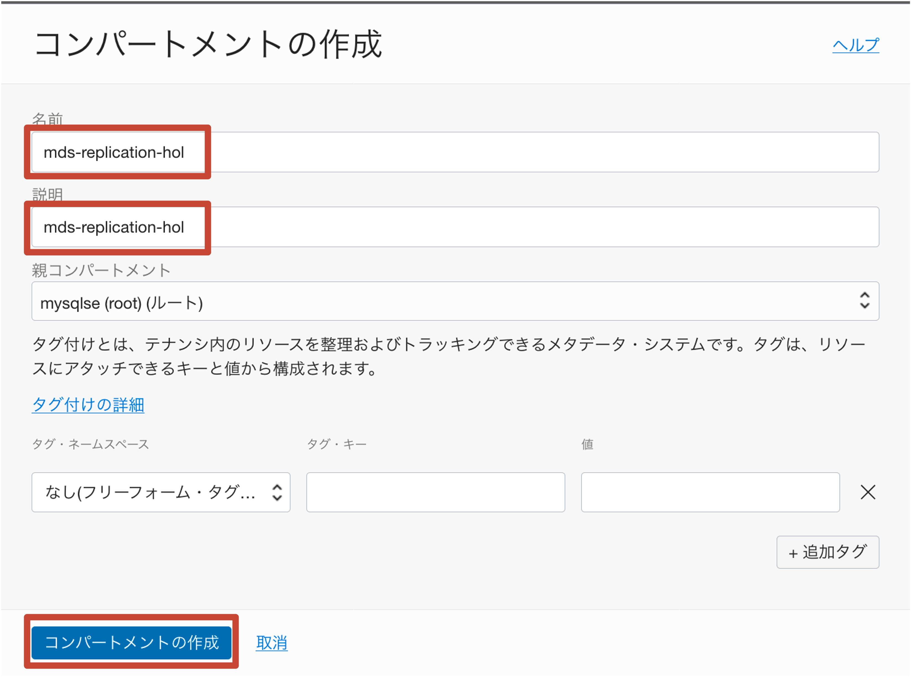

### **Step 1.5:**
  正常に完了すると以下の画面が出力されます
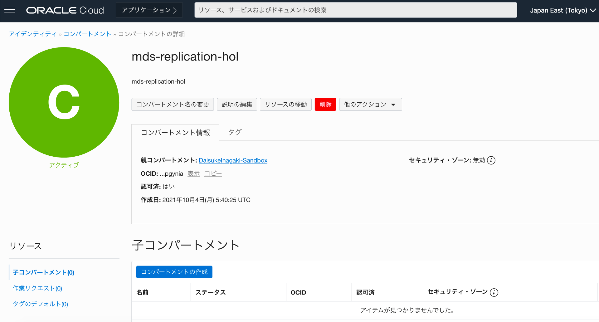

### **Step 1.6:**
　コンパートメントが作成されたので、VCNを作成しましょう。 
  メインメニューから _**ネットワーキング >> 仮想クラウド・ネットワーク**_ を選択します

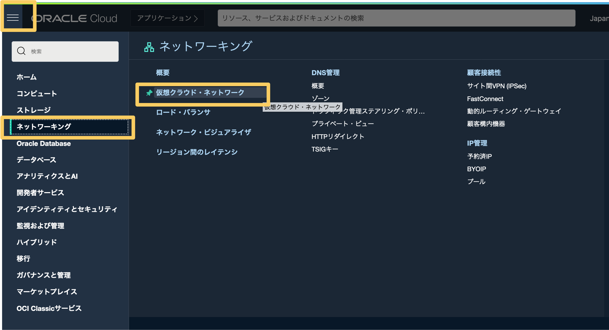

### **Step 1.7:**
  In the left bottom pane below the context menu, expand the _**Compartment drop down list**_ and select the _**mds-replication-hol**_ compartment.

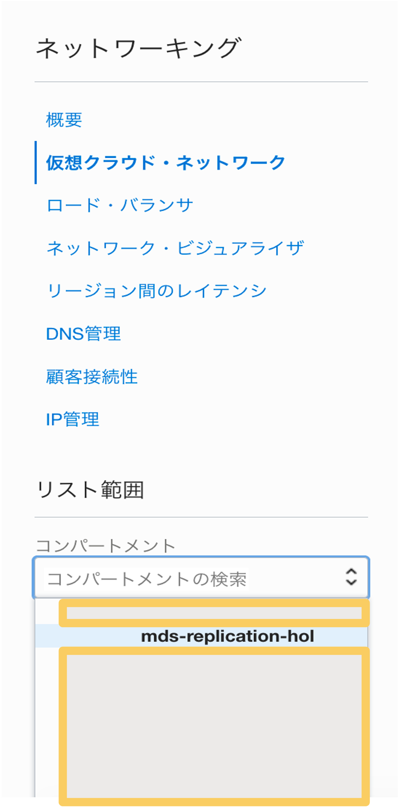

### **Step 1.8:**
  In the context menu on the top left make sure _**Virtual Cloud Networks**_ is selected, and then click the button _**Start VCN Wizard**_

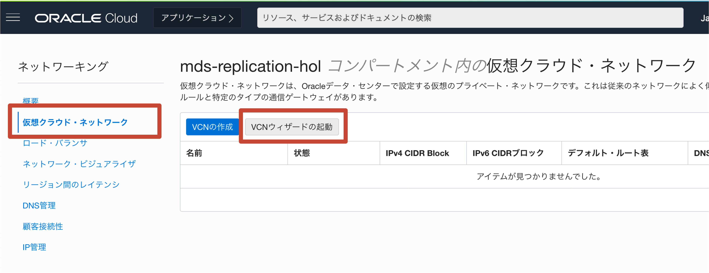

### **Step 1.9:**
  When the wizard starts, select _**VCN with Internet Connectivity**_ and click on _**Start VCN Wizard**_

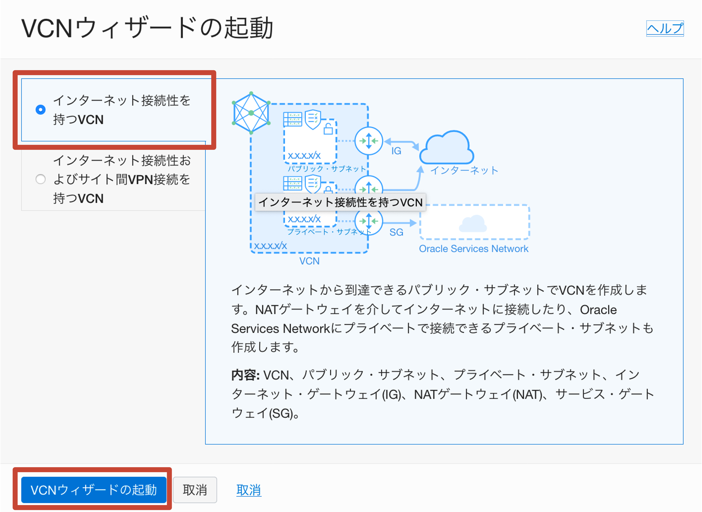

### **Step 1.10:**
  In the _**VCN NAME**_ field enter _**mds-replication-hol-vcn**_, leave the rest as per default, and click _**Next**_

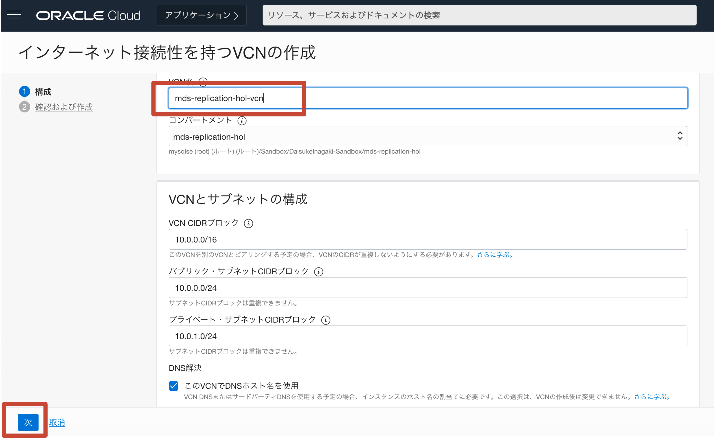

### **Step 1.11:**
   _**作成**_にて作成データの確認を行います。

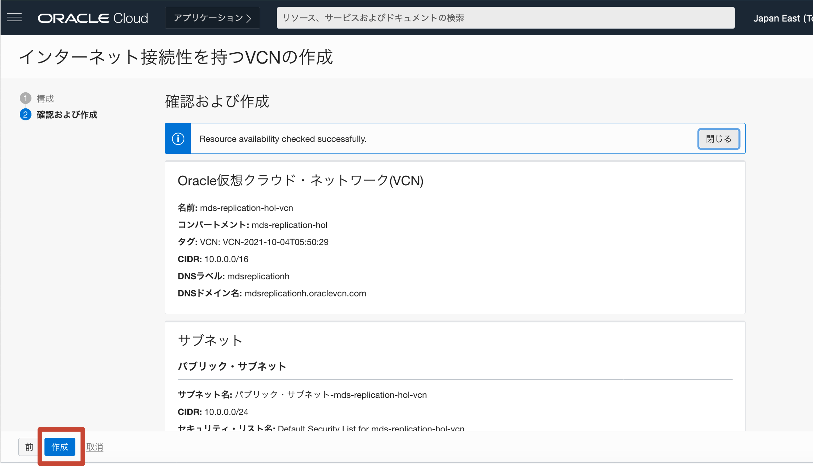

### **Step 1.12:**
  VCNの作成後、下の図のように関連するページに移動します。 表示後、_**パブリック-サブネット-mds-replication-hol-vcn**_をクリックします

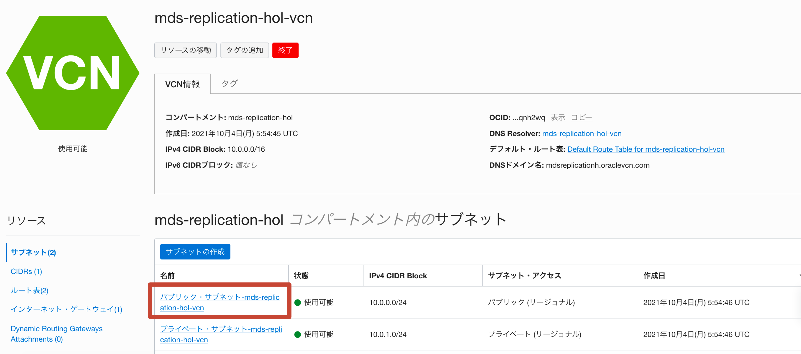

### **Step 1.13:**
 VCNのデフォルトのセキュリティリストを使用するようにサブネットを設定します。これにより、Oracle Cloud Infrastructureを使い始めることを容易にするように設計されています。 

 これで、_ ** default_security_list_for_mds-replication-hol-vcn ** _をクリックしてMySQLデータベースサービスポートを介してトラフィックを許可するVCNのデフォルトのセキュリティリストをカスタマイズします。 

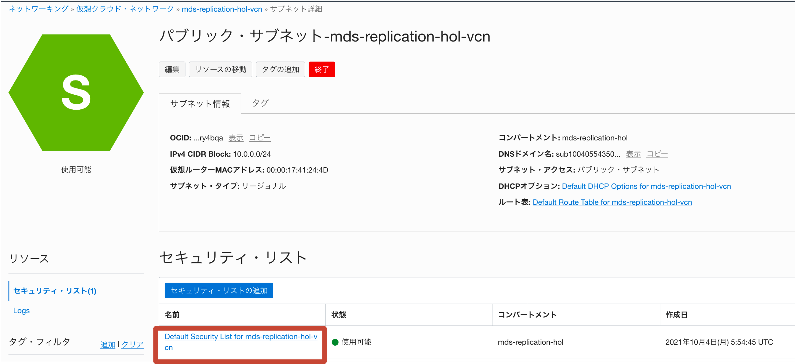

### **Step 1.14:**
  _**イングレスルールの追加**_をクリック

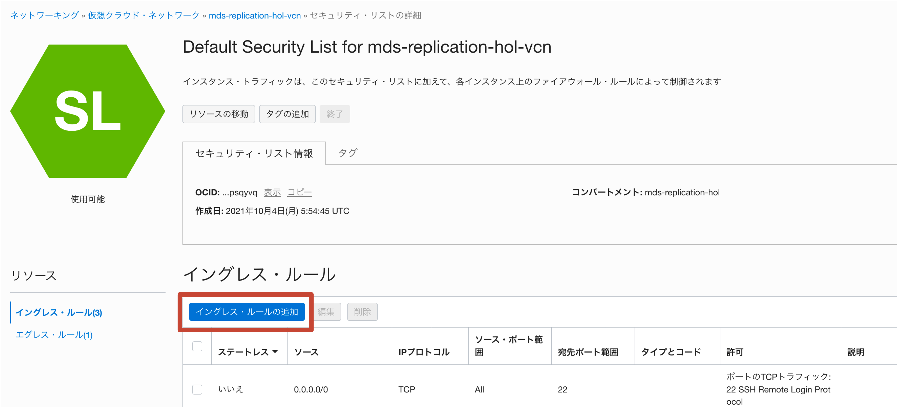

### **Step 1.15:**
 MySQLデータベースサービスポートを介してトラフィックを有効にするには、必要なルールをデフォルトのセキュリティリストに追加します 

Insert the details as below:
- Source CIDR:  _**0.0.0.0/0**_
- IP Protocol: _**TCP**_
- Destination Port Range: _**3306,33060**_

入力後 _**イングレスルールの追加**_をクリックします

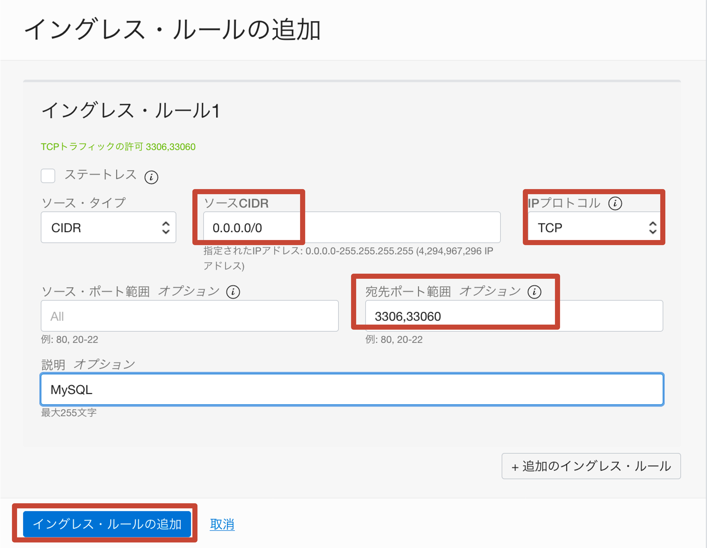

### **Step 1.16:**
  正常に完了すると以下のような表示となります:

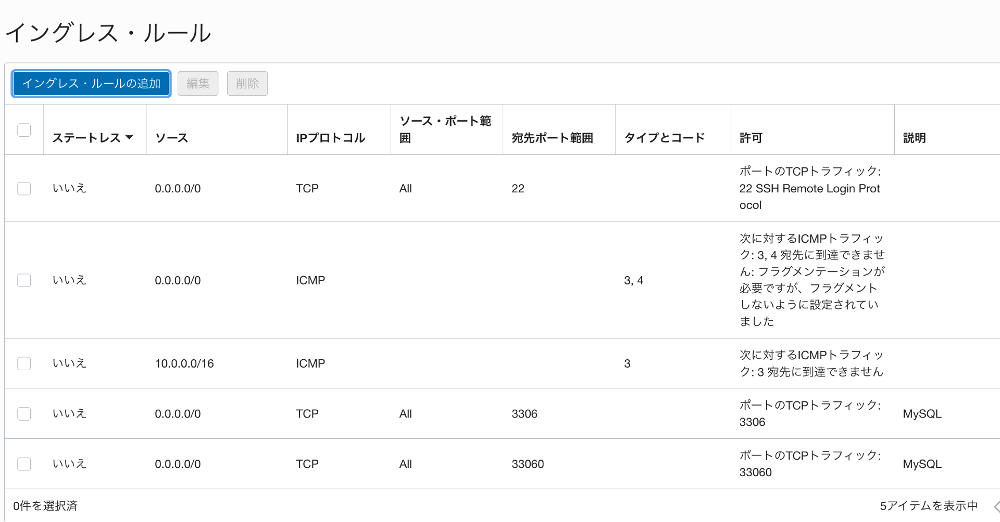

## Conclusion

コンパートメント、VCNを作成し、セキュリティリストに追加の入力ルールを追加したので、次のラボに進みます。 

Learn more about **[Compartments](https://docs.oracle.com/en-us/iaas/Content/GSG/Concepts/settinguptenancy.htm#Understa)**
Learn more about **[VCN and Subnets](https://docs.oracle.com/en-us/iaas/Content/Network/Tasks/managingVCNs_topic-Overview_of_VCNs_and_Subnets.htm)**

**[Home](README.md)** | **[Go to Lab 2 >>](../Lab2/README.md)**
