# Lab2: Replicationソースの構築


## Key Objectives:

- 特定のコンパートメントにコンピューティングインスタンスを作成する方法を学ぶ
- CloudShellを使用してssh経由でコンピューティングインスタンスに接続する方法を学ぶ
- ローカルデータベースサーバーに接続してスキーマを一覧表示するための基本的なMySQLコマンドを学習します

## Introduction

このラボの主な範囲は、既存のオンプレミスMySQL環境をモックアップするために、レプリケーションソースを構築することです。 これを可能な限り簡単に実現するために、cloud-initスクリプトを使用して事前に初期化されたコンピューティングインスタンスを構築します。このインスタンスは、ユーザーに代わってMySQL環境をインストール、構成、および設定します。
さらに、このラボと次のラボで、CloudShellを使用して環境とやり取りします。

Oracle Cloud Infrastructure Computeを使用すると、インスタンスと呼ばれるコンピューティングホストをプロビジョニングおよび管理できます。 コンピューティングとアプリケーションの要件を満たすために、必要に応じてインスタンスを起動できます。 インスタンスを起動した後、コンピュータから安全にアクセスし、再起動し、ボリュームをアタッチおよびデタッチし、終了したら終了することができます。 
**[Compute Instances overview](https://docs.oracle.com/en-us/iaas/Content/Compute/Concepts/computeoverview.htm)**

Cloud-initは、クロスプラットフォームのクラウドインスタンスを初期化するための業界標準のマルチディストリビューション方式です。 これは、すべての主要なパブリッククラウドプロバイダー、プライベートクラウドインフラストラクチャのプロビジョニングシステム、およびベアメタルインストールでサポートされています。 
**[Cloud-init documentation](https://cloudinit.readthedocs.io/en/latest/index.html)**

Oracle Cloud Infrastructure Cloud（OCI）シェルは、Oracle CloudConsoleからアクセスできるWebブラウザベースの端末です。 Cloud Shellは無料で（毎月のテナント制限内で）使用でき、事前認証されたOracle Cloud Infrastructure CLI、事前認証されたAnsibleインストール、およびOracle CloudInfrastructureサービスのチュートリアルに従うためのその他の便利なツールを備えたLinuxシェルへのアクセスを提供します。 Cloud Shellは、すべてのOCIユーザーが利用できる機能であり、コンソールからアクセスできます。 
**[Cloud Shell overview](https://docs.oracle.com/en-us/iaas/Content/API/Concepts/cloudshellintro.htm)**


## Steps

### **Step 2.1:**
- 左メニューから _**コンピュート >> インスタンス**_　と選択します

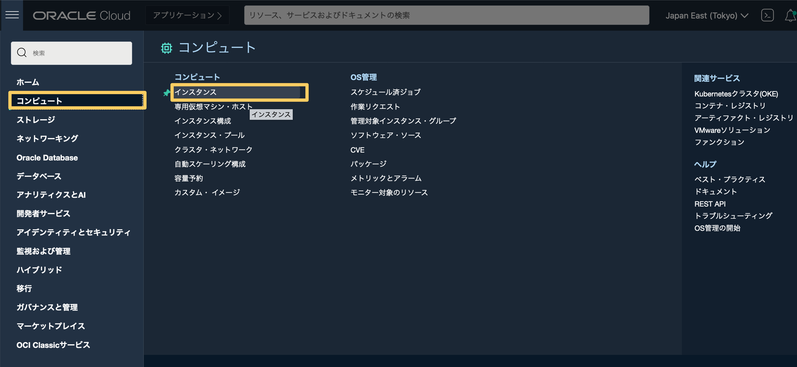

### **Step 2.2:**
- コンパートメントセレクターで、mds-replication-holコンパートメントが選択されていることを確認します。

- _**インスタンスの作成**_ボタンをクリックします。 
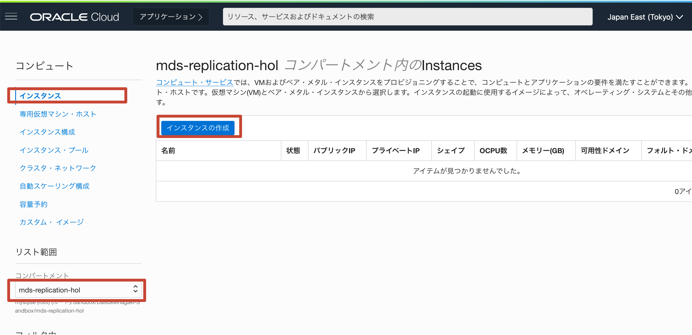

### **Step 2.3:**
- _**名前**_ には _**mysql-replication-source**_ を入力します (他の名前でも結構です).

- _**配置**_ はデフォルト設定のままで問題ありません


### **Step 2.4:**
- _ **イメージとシェイプ** _セクションで、使用するオペレーティングシステムイメージと割り当てるリソースを定義できます。
- セクションが折りたたまれている場合は、_ **編集** _をクリックして展開します。
- _ ** イメージ ** _サブセクションで、_ ** イメージの変更 ** _ボタンをクリックします。 


### **Step 2.5:**
- **「すべてのイメージの参照」** ウィンドウで、**「Oracle Linux」** を選択し、**「OSバージョン」** ドロップダウン・ボックスを展開して、**「8」** を選択します。 


### **Step 2.6:**
- **「イメージの選択」** ボタンをクリックします 


### **Step 2.7:**
- _**Shape**_ サブセクションで _**Change Shape**_　をクリックします


### **Step 2.8:**
- [すべてのシェイプを参照]ウィンドウで、**[AMD]** ボックスをクリックします。 次に、**VM.Standard.E4.Flex** の下の **[CPUの数]** 入力ボックスに **2** と入力し、**[メモリの量（GB）]** 入力ボックスに値 **32** が自動的に入力されるまで待ちます。その後、[シェイプの選択]をクリックします

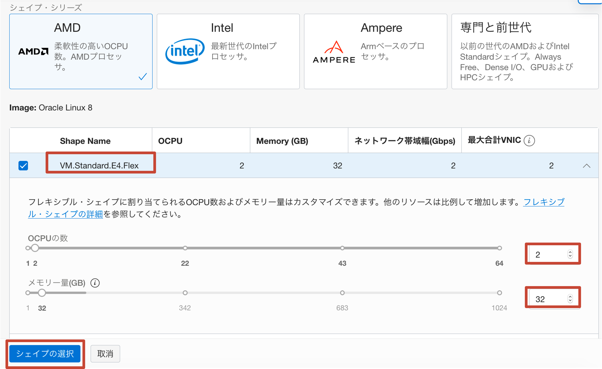

### **Step 2.9:**
- **ネットワーキング** セクションに移動します
- セクションが折りたたまれている場合は、**編集** をクリックして展開します。
- セレクターで、VCNドロップダウンセレクターの **mds-replication-hol-vcn** と **パブリック-サブネット-mds-replication-hol-vcn（regional）** を選択していることを確認してください。 サブネットドロップダウンセレクターで。
- **パブリックIPv4アドレスの割り当て** ラジオボタンが選択されていることを確認します。 


### **Step 2.10:**
- **SSHキーの追加** セクションで、**[キーペアを自動で生成]** を選択し、**[秘密キーを保存]** をクリックしてください


- 秘密鍵がローカルマシンに保存されたら、ダウンロード場所とファイル名をメモします
### **Step 2.11:**
- 下にスクロールして、_**拡張オプションを表示**_ をクリックします。


### **Step 2.12:**
- **管理** タブで、**cloud-initスクリプトの貼り付け** ラジオボタンを選択します。 Cloud-initスクリプト入力ボックスは下の画像のように表示されます

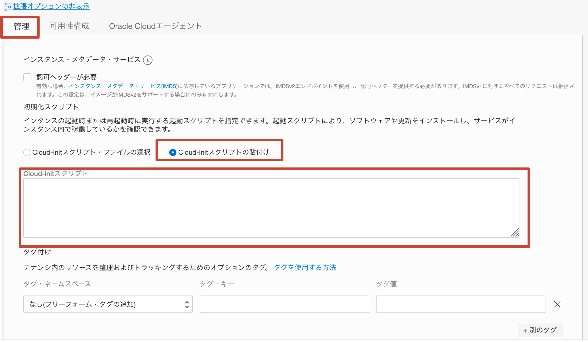

### **Step 2.13:**
- GitHubコードコピー機能を使用して、次のスクリプトをコピーして貼り付けます（コピーボタンはマウスホバーの左側に表示されます） :
```
#cloud-config
# Source: https://cloudinit.readthedocs.io/en/latest/topics/examples.html#yaml-examples
# check the yaml syntax with https://yaml-online-parser.appspot.com/
output: {all: '| tee -a /var/log/cloud-init-output.log'}
# Run these commands only at first boot
runcmd:
- 'echo "c2VkIC1pIHMvU0VMSU5VWD1lbmZvcmNpbmcvU0VMSU5VWD1wZXJtaXNzaXZlL2cgL2V0Yy9zeXNjb25maWcvc2VsaW51eApzZWQgLWkgcy9TRUxJTlVYPWVuZm9yY2luZy9TRUxJTlVYPXBlcm1pc3NpdmUvZyAvZXRjL3NlbGludXgvY29uZmlnCnN5c3RlbWN0bCBzdG9wIGZpcmV3YWxsZApzeXN0ZW1jdGwgZGlzYWJsZSBmaXJld2FsbGQKd2dldCBodHRwczovL2Rldi5teXNxbC5jb20vZ2V0L215c3FsODAtY29tbXVuaXR5LXJlbGVhc2UtZWw4LTEubm9hcmNoLnJwbQp5dW0gbG9jYWxpbnN0YWxsIC15IC0tbm9ncGdjaGVjayBteXNxbDgwLWNvbW11bml0eS1yZWxlYXNlLWVsOC0xLm5vYXJjaC5ycG0KeXVtIG1vZHVsZSAteSAtLW5vZ3BnY2hlY2sgZGlzYWJsZSBteXNxbAp5dW0gaW5zdGFsbCAteSAtLW5vZ3BnY2hlY2sgbXlzcWwtY29tbXVuaXR5LWNsaWVudCBteXNxbC1jb21tdW5pdHktc2VydmVyIG15c3FsLXNoZWxsCnN5c3RlbWN0bCBzdGFydCBteXNxbGQKZ3JlcCAndGVtcG9yYXJ5IHBhc3N3b3JkJyAvdmFyL2xvZy9teXNxbGQubG9nID4+IHBhc3N3b3JkLnR4dApzZWQgLWkgJ3MvXi4qOiAvL2cnIHBhc3N3b3JkLnR4dApteXNxbCAtLXVzZXI9cm9vdCAtLXBhc3N3b3JkPWBjYXQgcGFzc3dvcmQudHh0YCAtLWNvbm5lY3QtZXhwaXJlZC1wYXNzd29yZCAgLWUgInNldCBwYXNzd29yZCA9ICdPcmFjbGUuMTIzJzsiCm15c3FsIC11cm9vdCAtcE9yYWNsZS4xMjMgLWUgImNyZWF0ZSB1c2VyICdyb290J0AnJScgaWRlbnRpZmllZCBieSAnT3JhY2xlLjEyMyc7IgpteXNxbCAtdXJvb3QgLXBPcmFjbGUuMTIzIC1lICJncmFudCBhbGwgcHJpdmlsZWdlcyBvbiAqLiogdG8gJ3Jvb3QnQCclJyB3aXRoIGdyYW50IG9wdGlvbjsiCnN5c3RlbWN0bCBzdG9wIG15c3FsZAplY2hvICJpbm5vZGJfYnVmZmVyX3Bvb2xfc2l6ZT00RyIgPj4gL2V0Yy9teS5jbmYKZWNobyAibG9nLWJpbiIgPj4gL2V0Yy9teS5jbmYKZWNobyAiZ3RpZF9tb2RlPW9uIiA+PiAvZXRjL215LmNuZgplY2hvICJlbmZvcmNlX2d0aWRfY29uc2lzdGVuY3kiID4+IC9ldGMvbXkuY25mCnN5c3RlbWN0bCBzdGFydCBteXNxbGQKd2dldCBodHRwczovL2Rvd25sb2Fkcy5teXNxbC5jb20vZG9jcy93b3JsZF94LWRiLnRhci5negp0YXIgLXhmIHdvcmxkX3gtZGIudGFyLmd6IC0tc3RyaXAtY29tcG9uZW50cz0xCm15c3FsIC11cm9vdCAtcE9yYWNsZS4xMjMgLWgxMjcuMC4wLjEgLVAzMzA2IDwgd29ybGRfeC5zcWwKcmVib290Cg=="| base64 -d >> setup.sh'
- 'chmod +x setup.sh'
- './setup.sh'
final_message: "The system is finally up, after $UPTIME seconds"
```
This is a cloud init script which will install automatically MySQL Community Edition, intialize it to work as a Replication Source and import the sample "world" database.

_**MAKE SURE TO COPY AND PASTE THE SCRIPT CORRECTLY!!**_

Once done, click _**Create**_

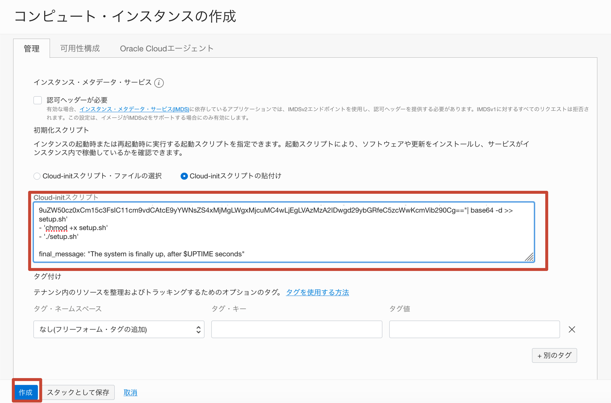

_**Additional extra information (NOT needed for the scopes of this lab)**_ :
As you might have realized, the cloud-init script which we are using, generates and runs a script from a base64 encoded string. This has been done in order to avoid issues which may occur when cloud-init processes special characters. For your reference, you can find the content of the script below:
```
sed -i s/SELINUX=enforcing/SELINUX=permissive/g /etc/sysconfig/selinux
sed -i s/SELINUX=enforcing/SELINUX=permissive/g /etc/selinux/config
systemctl stop firewalld
systemctl disable firewalld
wget https://dev.mysql.com/get/mysql80-community-release-el8-1.noarch.rpm
yum localinstall -y --nogpgcheck mysql80-community-release-el8-1.noarch.rpm
yum module -y --nogpgcheck disable mysql
yum install -y --nogpgcheck mysql-community-client mysql-community-server mysql-shell
systemctl start mysqld
grep 'temporary password' /var/log/mysqld.log >> password.txt
sed -i 's/^.*: //g' password.txt
mysql --user=root --password=`cat password.txt` --connect-expired-password  -e "set password = 'Oracle.123';"
mysql -uroot -pOracle.123 -e "create user 'root'@'%' identified by 'Oracle.123';"
mysql -uroot -pOracle.123 -e "grant all privileges on *.* to 'root'@'%' with grant option;"
systemctl stop mysqld
echo "innodb_buffer_pool_size=4G" >> /etc/my.cnf
echo "log-bin" >> /etc/my.cnf
echo "gtid_mode=on" >> /etc/my.cnf
echo "enforce_gtid_consistency" >> /etc/my.cnf
systemctl start mysqld
wget https://downloads.mysql.com/docs/world_x-db.tar.gz
tar -xf world_x-db.tar.gz --strip-components=1
mysql -uroot -pOracle.123 -h127.0.0.1 -P3306 < world_x.sql
reboot
```
**PLEASE NOTE:** This is a lab environment! We are showing you how to disable firewalld and selinux JUST for simplicity!! You are not intended ever to deploy this kind of configuration on a production environment since it may lead to serious security issues!!

### **Step 2.14:**
- The instance will enter _**Provisioning**_ state.

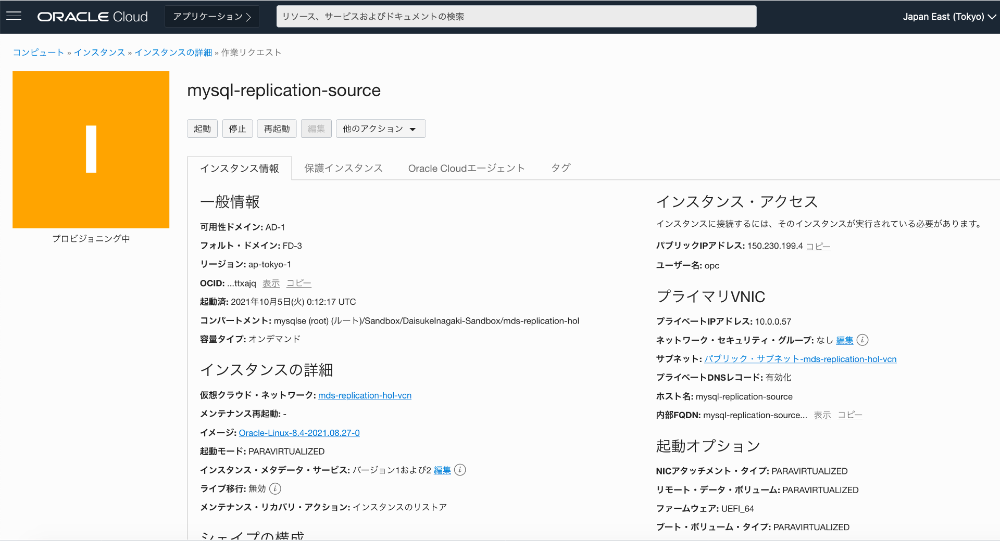

### **Step 2.15:**
- Once provisioning is finished, the instance will enter the _**Running**_ state. It should take about a minute or so.
Once the instance is _**Running**_, take note of the _**Public IP Address**_

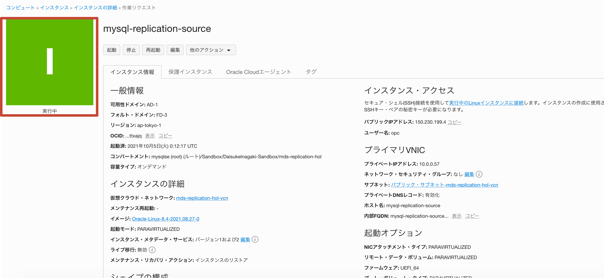

_**PLEASE NOTE**_: As soon as the instance enters the running state, the cloud-init script is triggered and requires some other minutes to complete. In the meanwhile, we will start connecting to the instance.

### **Step 2.16:**
- We will now access the newly created instance using cloud shell.
Click on the _**Cloud Shell**_ icon in the top right part of the screen.

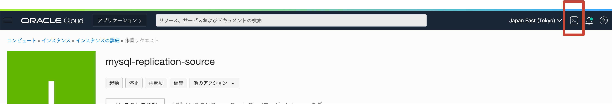

### **Step 2.17:**
- Once the Cloud shell comes up, familiarize with the commands. 
On the right part of top bar, you have the buttons to _**reduce to icon**_, _**exapnd**_ and _**close**_ the cloud shell.
On the left part of top bar, you have the _**cloud shell menu**_. Feel free to adjust the _**font size**_ as per picture below.

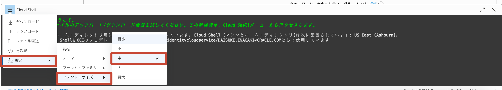

### **Step 2.18:**
- Take the previously saved private key file from your local machine, drag and drop it into the cloud shell, as shown in the picture below.


### **Step 2.19:**
- Once the upload completes, you will be notified, as per picture below

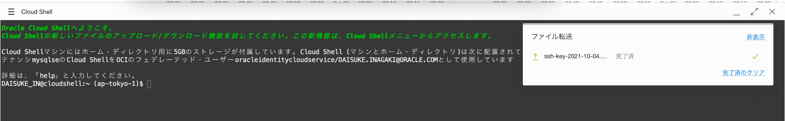

### **Step 2.20:**
_**PLEASE NOTE**_: In this step we will connect  to the MySQL Replication Source instance. Prior to executing this step, allow it an extra couple of minutes for the cloud-init script to complete its execution and for the instance to reboot.

- In order to connect to the Replication Source Instance using the _**Public IP Address**_, execute the following steps:

a - Rename the recently transferred private key file and assign the privileges required by OCI:
```
mv ssh-*.key replication-source.key
chmod 600 replication-source.key
```
b - Connect to the newly created _**MySQL Replication Source**_ instance over ssh, replacing the  _**Public IP Address**_ after the "@":
```
ssh -i replication-source.key opc@<source-instance-public-ip>
```
c - If prompted to accept fingerprints, enter _**yes**_

d - Once successfully connected to the replication source instance, execute the following command:
```
mysql -uroot -pOracle.123
```

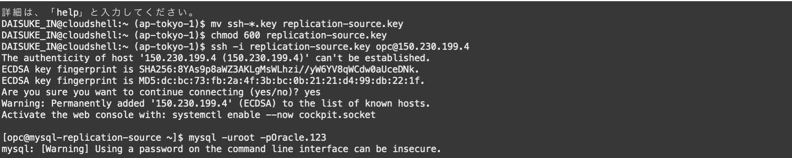

### **Step 2.21:**
- Once connected to the MySQL server, execute the following command  to list the existing databases
```
show databases;
```
You will notice a schema called _**world_x**_

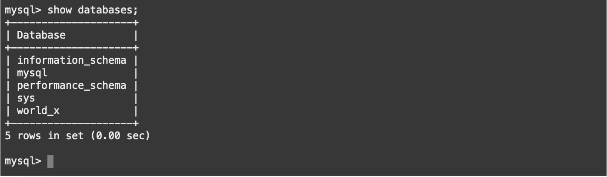

### **Step 2.22:**
- Type _**exit**_ to close the MySQL session and again _**exit**_ to close the ssh session.
- Reduce the Cloud Shell to icon and proceed to the following lab.

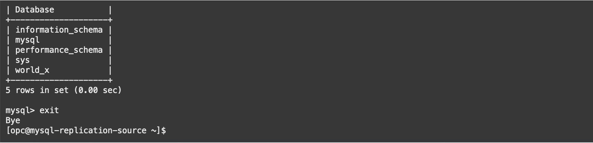

## Conclusion

Now that you have created your Replication Source, you are ready to progress to the next Lab!

Learn more about **[Compute Instances](https://docs.oracle.com/en-us/iaas/Content/Compute/Concepts/computeoverview.htm)**
Learn more about **[Cloud-init](https://cloudinit.readthedocs.io/en/latest/index.html)**
Learn more about **[Cloud Shell](https://docs.oracle.com/en-us/iaas/Content/API/Concepts/cloudshellintro.htm)**

**[<< Go to Lab 1](../Lab1/README.md)** | **[Home](/README.md)** | **[Go to Lab 3 >>](../Lab3/README.md)**
