# Lab 3: MDSの構築

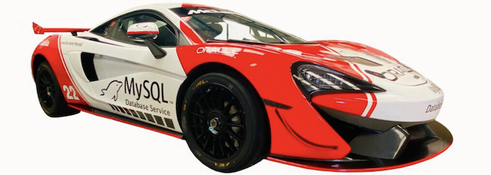

## 目的:
- スタンドアロンMySQLデータベースサービスをデプロイおよび構成する方法を学習します
- MySQLデータベースサービスの管理者ユーザーを作成する方法を学びます

## Introduction

MySQLデータベースサービスは、フルマネージドのOracle Cloud Infrastructureネイティブサービスであり、OracleのMySQLチームによって開発、管理、およびサポートされています。 Oracleは、バックアップとリカバリ、データベースとオペレーティングシステムのパッチ適用などのすべてのタスクを自動化します。 お客様は、データ、スキーマ設計、およびアクセスポリシーの管理のみを担当します。
**[MySQL Database Service overview](https://docs.oracle.com/en-us/iaas/mysql-database/doc/overview-mysql-database-service.html)**


## Steps

### **Step 3.1:**
- 左メニューより _**データベース >> DBシステム**_ を選択する

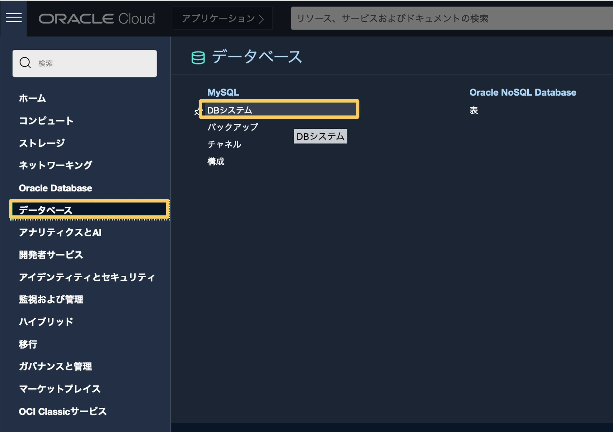

### **Step 3.2:**
- 前の手順で、DBシステムの作成ページに移動します。左側のコンパートメントセレクターを見て、VCNの作成に使用したのと同じコンパートメントを使用していることを確認します。 完了したら、_**MySQL DBシステムの作成**_ をクリックします。 

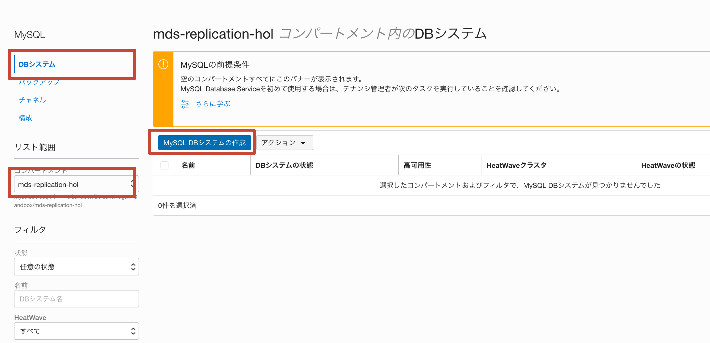

### **Step 3.3:**
- DBシステムの作成を開始します。 コンパートメントを再度クロスチェックし、DBシステムに名前 _**mds-replication-hol-replica**_ を割り当て、_**スタンドアロン**_ ボックスを選択します。 これにより、レプリカとして使用するスタンドアロンのMySQLDBシステムを作成できます。 他のボックスは無視してください。 

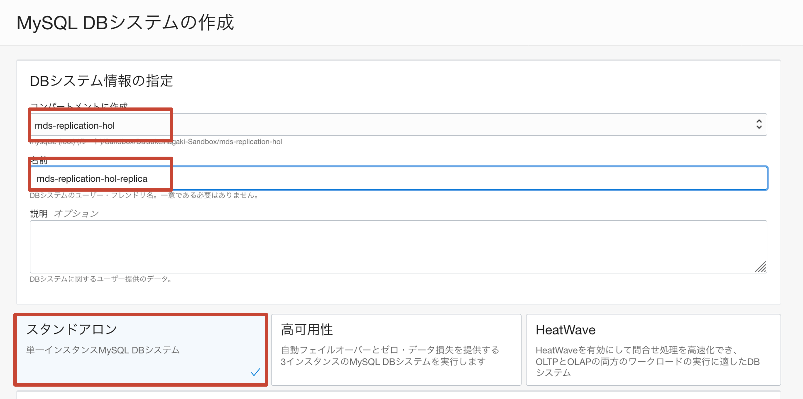

### **Step 3.4:**
  _**管理者資格証明書の作成**_ には以下を入力します:
```
username: admin
password: Oracle.123
confirm password: Oracle.123
```

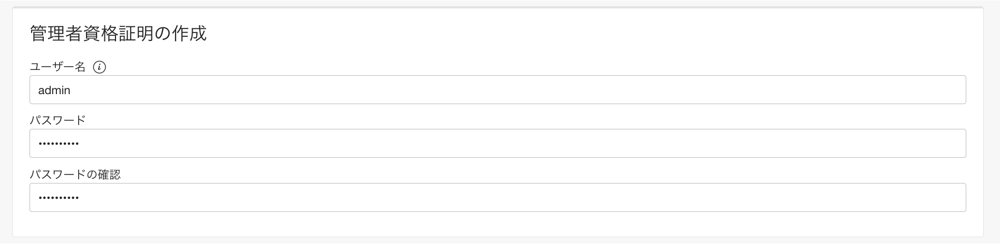

### **Step 3.5:**
- _**ネットワーキングの構成**_ にはVCNには _**mds-replication-hol**_ と _**パブリックサブネット**_ の選択肢から (_**パブリック・サブネット-replication-hol-vcn**_)を指定します

- デフォルトの可用性ドメインのままにして、_**ハードウェアの構成**_　セクションに進みます

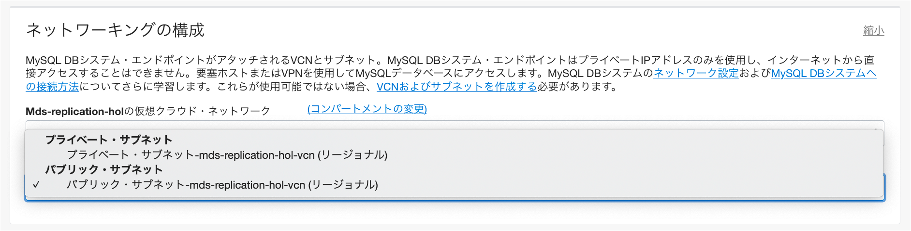

### **Step 3.6:**
- _**ハードウェアの構成**_ セクションで、選択した形状が **MySQL.VM.Standard.E3.1.8GB、CPUコア数：1、メモリサイズ：8 GB、データストレージサイズ：50** であることを確認します。

- _**バックアップの構成**_ セクションで、デフォルトのバックアップウィンドウを7日間のままにします。 

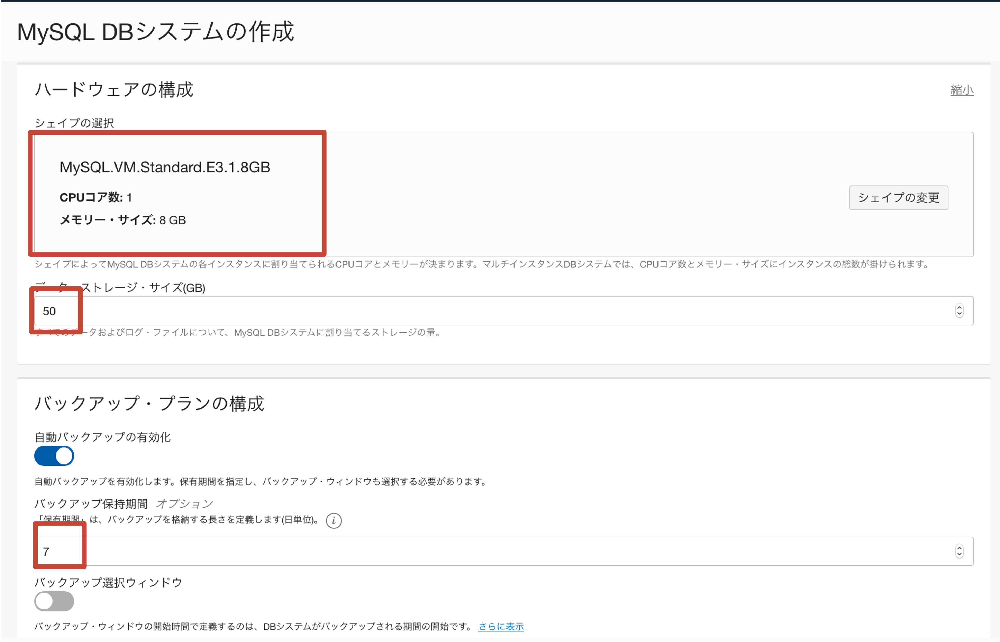

### **Step 3.7:**
- スクロールダウンにて _**拡張オプションの表示**_ をクリックします 

- 構成タブ内の _**構成の選択**_　をクリックします

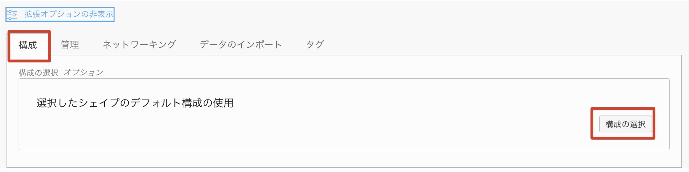

### **Step 3.8:**
- _**すべてのタイプ**_ ウィンドウで、_**MySQL.VM.Standard.E3.1.8GB.Standalone**_ を選択し、_**構成の選択**_ をクリックします。 

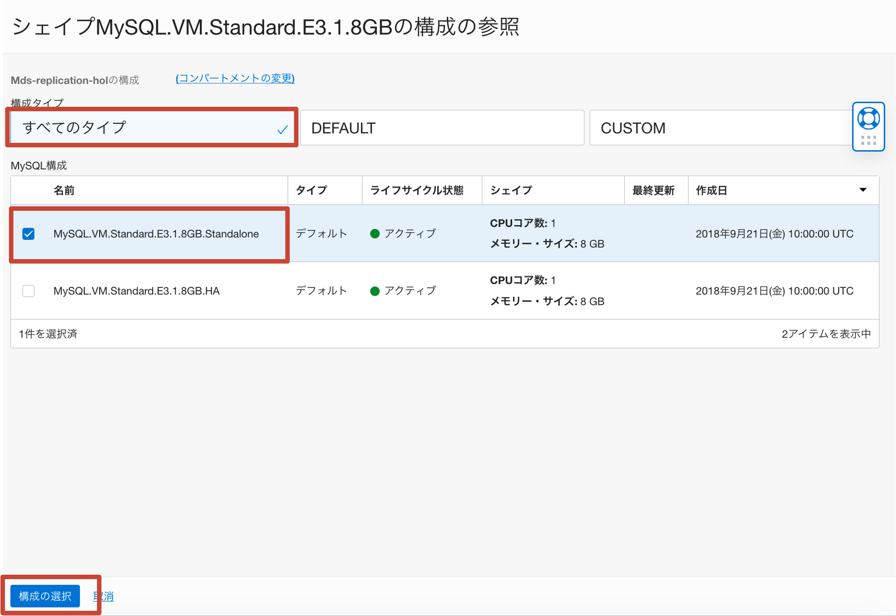

### **Step 3.9:**
- 構成を選択したら、_**ネットワーク**_ タブに移動し、_**ホスト名**_ フィールドに _**mysql-replication-hol-replica**_ （DBシステム名と同じ）と入力します。 
Check that port configuration corresponds to the following:
MySQL Port: 3306
MySQL X Protocol Port: 33060
確認後 _**作成**_ ボタンを押下します

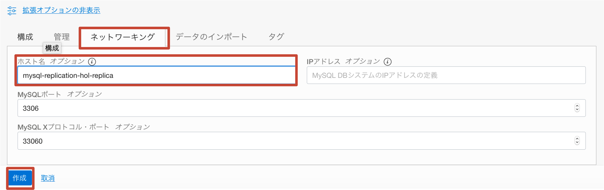

### **Step 3.10:**
- MySQL DBシステムは　_**作成中**_　状態になります（下の図のように）。 その間、先に進んで次のラボに進むことができます。 

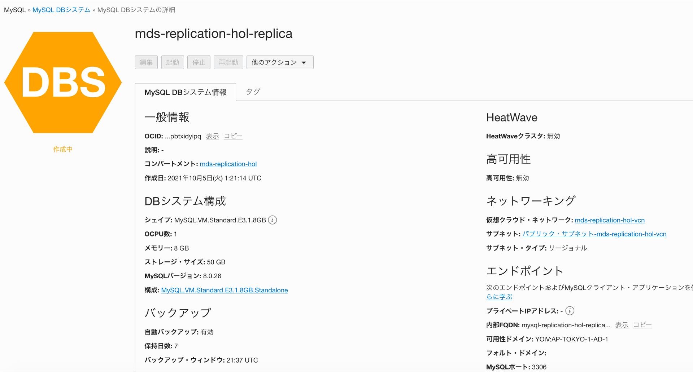

## Conclusion

このラボでは、MySQLデータベースサービスをデプロイし、データベースの管理ユーザーを作成しました。 すべて設定され、複製する準備ができていますか？ まだ、MySQLデータベースサービスがパブリックIPを公開していないことに気付いたかもしれませんが、MySQLルーターをインストールする踏み台ホストを介して公開する必要があります。 

Learn more about **[MySQL Database Service](https://docs.oracle.com/en-us/iaas/mysql-database/doc/overview-mysql-database-service.html)**

**[<< Go to Lab 2](../Lab2/README.md)** | **[Home](/README.md)** | **[Go to Lab 4 >>](../Lab4/README.md)**
