# Lab 4: Replicationの準備


## Key Objectives:
- 特定のコンパートメントにコンピューティングインスタンスを作成する方法を学ぶ
- CloudShellを使用してssh経由でコンピューティングインスタンスに接続する方法を学ぶ
- レプリケーションソースを指すようにMySQLルーター構成を変更し、接続をテストします

## Introduction
このラボでは、MySQLルーターをホストするコンピューティングインスタンスをデプロイします。 お気づきのとおり、MySQLデータベースサービスDBシステムはプライベートIPアドレスのみを公開しているため、パブリックインターネットを介してネイティブに通信することはできません。 パブリックインターネットとの通信は、次の2つの方法で実現できます:
- OCIテナンシーとオンプレミスデータセンター間のIPSecVPN接続のセットアップ：**[IPSecの概要](https://docs.oracle.com/en-us/iaas/Content/Network/Tasks/managingIPsec.htm)**
- 
- パブリックインターネットにアクセスできるコンピュートインスタンスで実行されているMySQLルーターを使用して、リバースプロキシとして機能し、OCI内部ネットワークを介して受信したデータベーストラフィックをソースのオンプレミスMySQLインスタンスにルーティングします。 MySQLルーターは、元々、オンプレミスの高可用性セットアップに透過的なルーティングレイヤーを提供することを目的としていますが、そうするように構成されている場合は、単一のインスタンスへの単純なルーティングも提供できます。 
**[MySQL Router Overview](https://www.mysql.com/it/products/enterprise/router.html)**

IPSec接続は、オンプレミス環境をOCIに接続するために使用される最も安全なアプローチです。 このハンズオンラボでは、簡単にするために、MySQLルーターを使用してパブリックインターネット経由でデータベーストラフィックを公開します。

実行する手順により、cloud-initスクリプトを使用して、MySQLルーターを自動的にデプロイおよび構成できます。 デプロイ後、ルーター構成でMySQLソースインスタンスのIPアドレスを設定します。

## Steps

### **Step 4.1:**
- 左上隅のメインメニューから、_**コンピューティング >> インスタンス**_ を選択します 

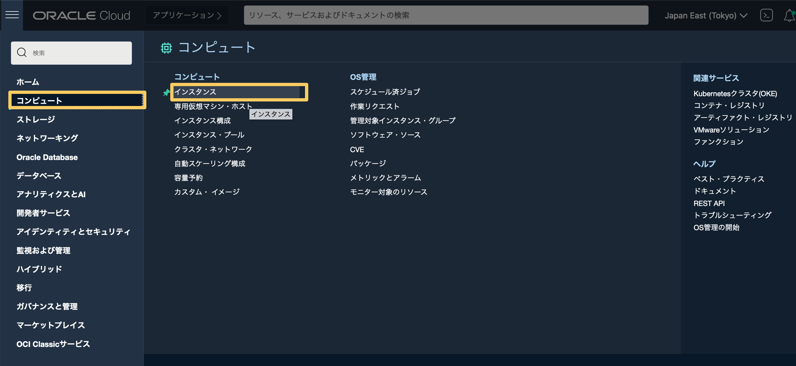

### **Step 4.2:**
- コンパートメントセレクターで、_**mds-replication-hol**_ コンパートメントが選択されていることを確認します。

- _**インスタンスの作成**_ ボタンをクリックします。 

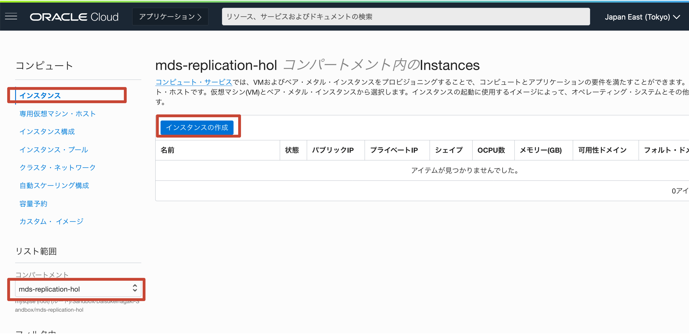

### **Step 4.3:**
- _**名前**_ フィールドに、_**mysql-replication-router**_ （または都合のよい他の名前）を挿入します。

- _**配置**_ セクションは、AvailabilityDomainとFaultDomainを変更できるセクションです。 このワークショップの範囲では、すべてをデフォルトのままにします。 
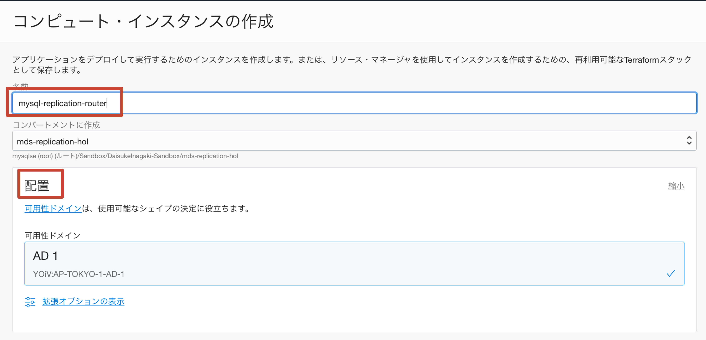

### **Step 4.4:**
- _**イメージとシェイプ**_ セクションでは、使用するオペレーティングシステムイメージと割り当てるリソースを定義できます
- セクションが折りたたまれている場合は、_**編集**_ をクリックして展開します
- _**イメージ**_ サブセクションで、_**イメージの変更**_ ボタンをクリックします

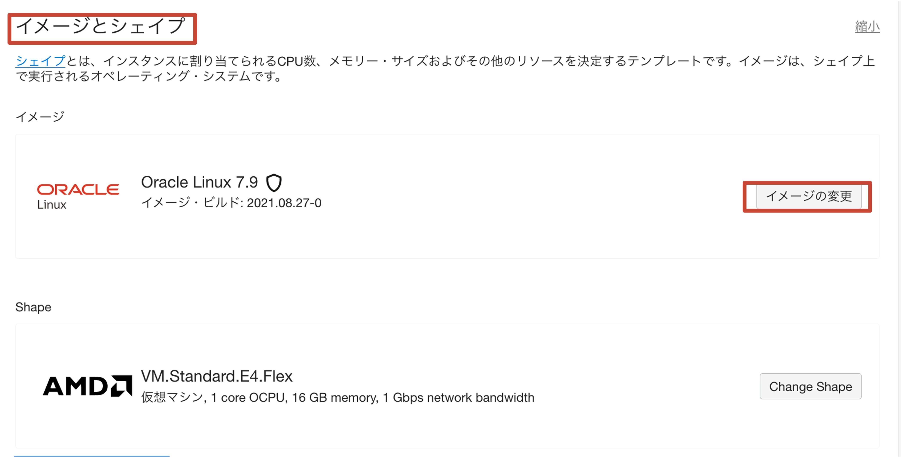

### **Step 4.5:**
- _**すべてのイメージを参照**_ ウィンドウで、_**Oracle Linux**_ を選択し、ドロップダウン _**OSバージョン**_ ボックスを展開して、_**8**_ を選択します。 

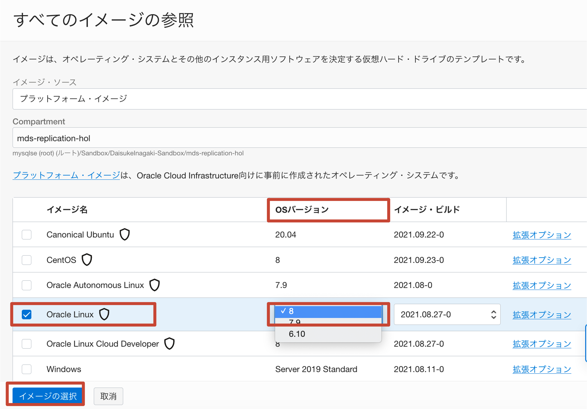

### **Step 4.6:**
- _**イメージの選択**_ ボタンをクリック


### **Step 4.7:**
- _**shape**_ サブセクションで _**シェイプの変更**_ をクリックします 

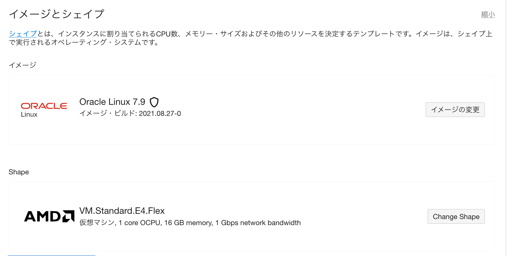

### **Step 4.8:**
- _**すべての形状を参照**_ ウィンドウで、_**AMD**_ ボックスをクリックします。 次に、_**VM.Standard.E4.Flex**_ の下の _**OCPUの数**_ 入力ボックスに _**2**_ と入力し、_**Memory（GB ）**_ 入力ボックスには、値 _**32**_ が自動的に入力されます。 その後、_**シェイプの選択**_ をクリックします 
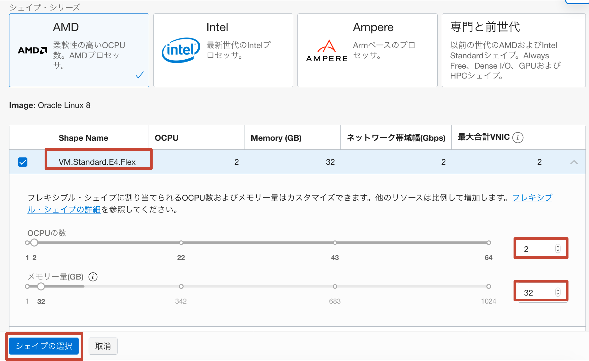

### **Step 4.9:**
- _**ネットワーキング**_ セクションに移動します
- セクションが折りたたまれている場合は、_**編集**_ をクリックして展開します
- VCNドロップダウンセレクターで _**mds-replication-hol-vcn**_ を選択し、サブネットドロップで _**パブリック・サブネット-mds-replication-hol-vcn（Regional）**_ を選択していることを確認してください ダウンセレクター
- _**パブリックIPv4アドレスの割り当て**_ ラジオボタンが選択されていることを確認します

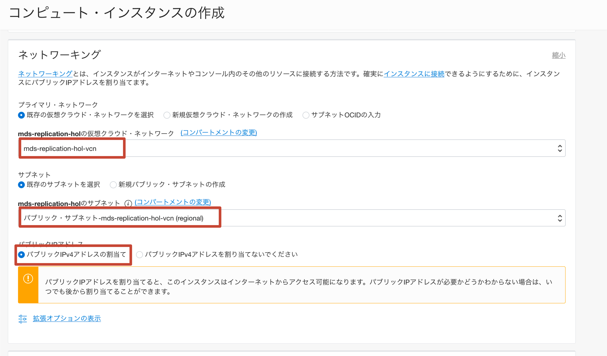

### **Step 4.10:**
- _**SSHキーの追加**_ セクションで、必ず _**キーペアの生成**_ を選択し、_**秘密キーの保存**_ をクリックしてください。

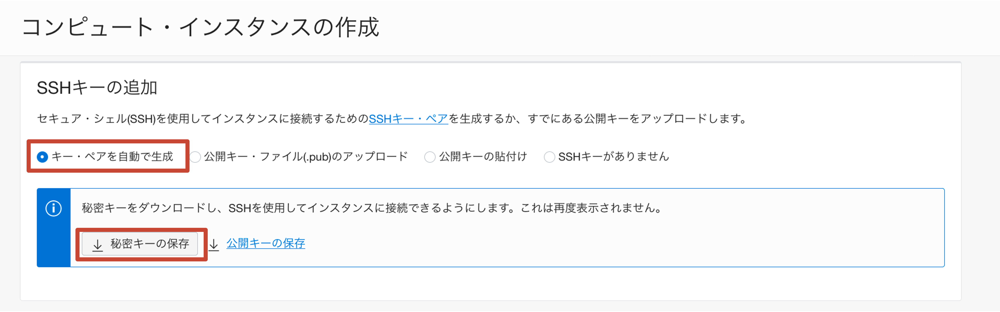

- 秘密鍵がローカルマシンに保存されたら、ダウンロード場所とファイル名をメモします

_**注意:**_ OCIは、作成日以降に名前を付けた秘密鍵用に生成します（例：ssh-key-YYYY-MM-DD.key）。 同じ日に2つ以上の秘密鍵を生成すると、オペレーティングシステムが保存時にファイル名を変更する場合があります。 たとえば、保存している現在の秘密鍵は、次のような命名規則に従う場合があります：ssh-key-YYYY-MM-DD（1）.key　したがって、注意して正しいファイル名に注意してください。 

### **Step 4.11:**
- Scroll down and after the _**Boot Volume**_ section, click on _**Show advanced options**_

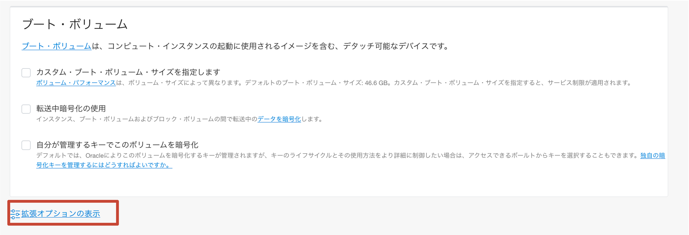

### **Step 4.12:**
- In the _**Management**_ tab, select the _**Paste cloud-init script**_ radio button. The _**Cloud-init script**_ input box will appear as per below image.

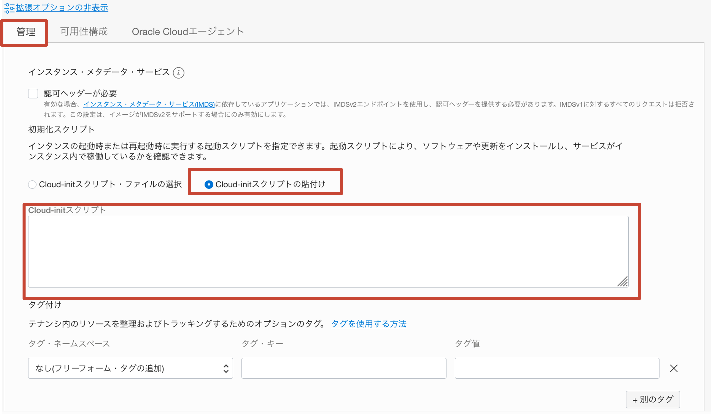

### **Step 4.13:**
- Paste-in the following script:
```
#cloud-config
# Source: https://cloudinit.readthedocs.io/en/latest/topics/examples.html#yaml-examples
# check the yaml syntax with https://yaml-online-parser.appspot.com/
output: {all: '| tee -a /var/log/cloud-init-output.log'}
# Run these commands only at first boot
runcmd:
- 'echo "c2VkIC1pIHMvU0VMSU5VWD1lbmZvcmNpbmcvU0VMSU5VWD1wZXJtaXNzaXZlL2cgL2V0Yy9zeXNjb25maWcvc2VsaW51eApzZWQgLWkgcy9TRUxJTlVYPWVuZm9yY2luZy9TRUxJTlVYPXBlcm1pc3NpdmUvZyAvZXRjL3NlbGludXgvY29uZmlnCnN5c3RlbWN0bCBzdG9wIGZpcmV3YWxsZApzeXN0ZW1jdGwgZGlzYWJsZSBmaXJld2FsbGQKd2dldCBodHRwczovL2Rldi5teXNxbC5jb20vZ2V0L215c3FsODAtY29tbXVuaXR5LXJlbGVhc2UtZWw4LTEubm9hcmNoLnJwbQp5dW0gbG9jYWxpbnN0YWxsIC15IC0tbm9ncGdjaGVjayBteXNxbDgwLWNvbW11bml0eS1yZWxlYXNlLWVsOC0xLm5vYXJjaC5ycG0KeXVtIG1vZHVsZSAteSAtLW5vZ3BnY2hlY2sgZGlzYWJsZSBteXNxbAp5dW0gaW5zdGFsbCAteSAtLW5vZ3BnY2hlY2sgbXlzcWwtc2hlbGwgbXlzcWwtcm91dGVyLWNvbW11bml0eSAKZWNobyAiIiA+PiAvZXRjL215c3Fscm91dGVyL215c3Fscm91dGVyLmNvbmYKZWNobyAiW3JvdXRpbmc6cHJpbWFyeV0iID4+IC9ldGMvbXlzcWxyb3V0ZXIvbXlzcWxyb3V0ZXIuY29uZgplY2hvICJiaW5kX2FkZHJlc3MgPSAwLjAuMC4wIiA+PiAvZXRjL215c3Fscm91dGVyL215c3Fscm91dGVyLmNvbmYKZWNobyAiYmluZF9wb3J0ID0gMzMwNiIgPj4gL2V0Yy9teXNxbHJvdXRlci9teXNxbHJvdXRlci5jb25mCmVjaG8gImRlc3RpbmF0aW9ucyA9IFNPVVJDRV9QVUJMSUNfSVA6MzMwNiIgPj4gL2V0Yy9teXNxbHJvdXRlci9teXNxbHJvdXRlci5jb25mCmVjaG8gInJvdXRpbmdfc3RyYXRlZ3kgPSBmaXJzdC1hdmFpbGFibGUiID4+IC9ldGMvbXlzcWxyb3V0ZXIvbXlzcWxyb3V0ZXIuY29uZg=="| base64 -d >> setup.sh'
- 'chmod +x setup.sh'
- './setup.sh'
final_message: "The system is finally up, after $UPTIME seconds"
```
This is a cloud init script which will install MySQL Shell and MySQL Router, configuring it to require minimal effort to point it to Replication Source MySQL Instance.

_**MAKE SURE TO COPY AND PASTE THE SCRIPT CORRECTLY!!**_

- Once done, click _**Create**_

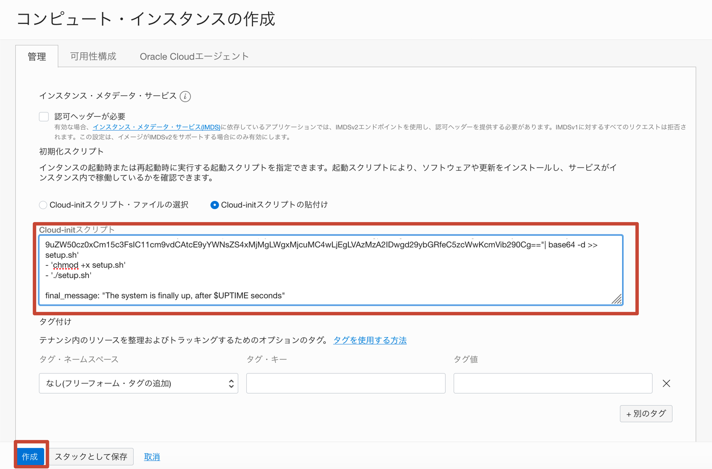

_**Additional extra information (NOT needed for the scopes of this lab)**_ :
As you might have realized, the cloud-init script which we are using, generates and runs a script from a base64 encoded string. This has been done in order to avoid issues which may occur when cloud-init processes special characters. For your reference, you can find the content of the script below:
```
sed -i s/SELINUX=enforcing/SELINUX=permissive/g /etc/sysconfig/selinux
sed -i s/SELINUX=enforcing/SELINUX=permissive/g /etc/selinux/config
systemctl stop firewalld
systemctl disable firewalld
wget https://dev.mysql.com/get/mysql80-community-release-el8-1.noarch.rpm
yum localinstall -y --nogpgcheck mysql80-community-release-el8-1.noarch.rpm
yum module -y --nogpgcheck disable mysql
yum install -y --nogpgcheck mysql-shell mysql-router-community 
echo "" >> /etc/mysqlrouter/mysqlrouter.conf
echo "[routing:primary]" >> /etc/mysqlrouter/mysqlrouter.conf
echo "bind_address = 0.0.0.0" >> /etc/mysqlrouter/mysqlrouter.conf
echo "bind_port = 3306" >> /etc/mysqlrouter/mysqlrouter.conf
echo "destinations = SOURCE_PUBLIC_IP:3306" >> /etc/mysqlrouter/mysqlrouter.conf
echo "routing_strategy = first-available" >> /etc/mysqlrouter/mysqlrouter.conf
```
**PLEASE NOTE:** This is a lab environment! We are showing you how to disable firewalld and selinux JUST for simplicity!! You are not intended ever to deploy this kind of configuration on a production environment since it may lead to serious security issues!!

### **Step 4.14:**
- The instance will enter _**Provisioning**_ state.

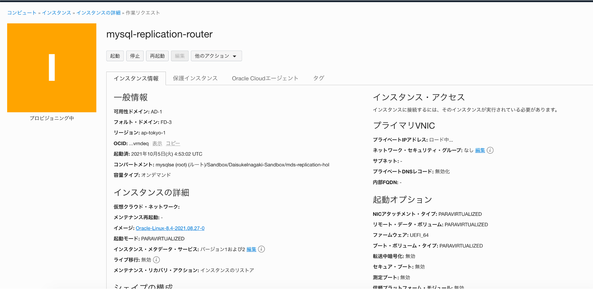

### **Step 4.15:**
- Once provisioning is finished, the instance will enter the _**Running**_ state. It should take about a minute or so.
Once the instance is _**Running**_, take note of the _**Public IP Address**_ for ssh connection and of the _**Internal FQDN**_ for setting up the _**Replication Channel**_ later on.

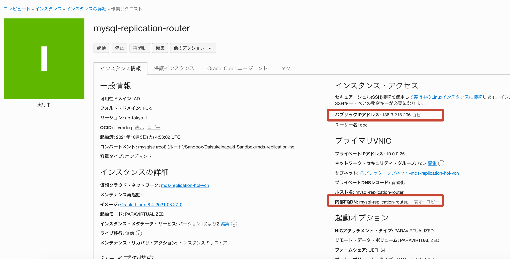

### **Step 4.16:**
- Go back to the _**Cloud Shell**_, take the previously saved private key file from your local machine, drag and drop it into the cloud shell, as shown in the picture below.

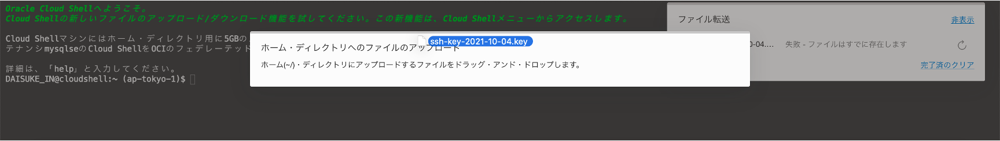

### **Step 4.17:**
_**PLEASE NOTE**_: In this step we will connect  to the MySQL Router instance. Prior to executing this step, allow it an extra couple of minutes  for the cloud-init script to complete its execution and for the instance to reboot.

- In order to connect to the MySQL Router Instance using the previously noted _**Public IP Address**_, execute the following steps:

a - Rename the recently transferred private key file and assign the privileges required by OCI
```
mv ssh-*.key router.key
chmod 600 router.key
```
b - Connect to the newly created _**MySQL Router**_ instance over ssh, replacing the  _**Public IP Address**_ after the "@":
```
ssh -i router.key opc@<router-instance-public-ip>
```
c - If prompted to accept fingerprints, enter _**yes**_

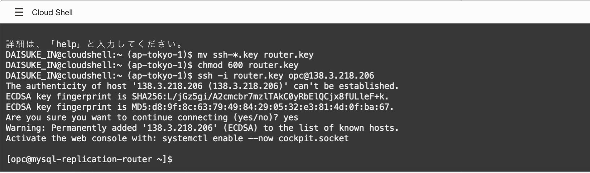

### **Step 4.18:**
- MySQLルーターがインストールされているインスタンスに正常に接続したら、_**MySQLレプリケーションソースのパブリックIPアドレス**_ を使用して、レプリケーションソースを指すようにMySQLルーターの構成を変更する必要があります。 通常のシナリオでは、_**/etc/mysqlrouter/mysqlrouter.conf**_ の下にあるMySQLルーター構成ファイルを変更する必要があります。

- 処理を高速化するために、このインスタンスにインストールされているMySQLルーターは事前構成されており、次のコマンドを実行して、_**MySQLレプリケーションソースパブリックIPアドレス**_ の構成に既に存在するプレースホルダーを更新する必要があります:
```
sudo sed -i 's/destinations =.*/destinations = <put-here-public-ip-of-mysql-replication-source>/g' /etc/mysqlrouter/mysqlrouter.conf
```
_**MySQLレプリケーションソースパブリックIPはどこで入手できますか？**_
移動先：_**メインメニュー>>コンピューティング>>インスタンス>>**_ _**mysql-replication-source>>**_ をクリックします _**パブリックIP**_ を確認します（下図参照）  

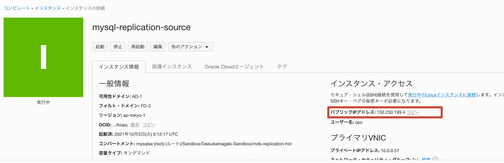

_**注意**_: 上記のコマンドを変更して _**MySQLレプリケーションソースパブリックIPアドレス**_ を挿入すると、コマンドは次の例のようになります:
_**sudo sed -i s/SOURCE_PUBLIC_IP/150.230.199.4/g /etc/mysqlrouter/mysqlrouter.conf**_


- 完了したら、構成ファイルの内容をチェックして、変数 _**destinations**_ が _**レプリケーションソースのパブリックIPアドレス**_ と等しいことを確認します:
```
cat /etc/mysqlrouter/mysqlrouter.conf
```

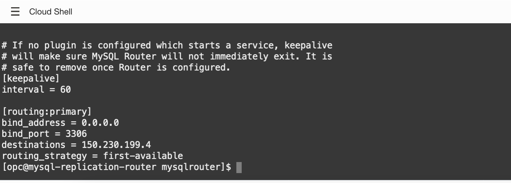

### **Step 4.19:**
- 次に、MySQLルーターを起動し、MySQLレプリケーションソースへの接続を確認します。
これを行うには、次の手順を実行します :

a - mysqlrouterサービスを起動時に開始できるようにし、mysqlrouterサービスを開始します 
```
sudo systemctl enable mysqlrouter
sudo systemctl start mysqlrouter
```

b - mysqlrouterにアクセスし、ルーターを _**MySQL Replication Source**_ であることをテストします 
```
mysqlsh --uri root:Oracle.123@127.0.0.1:3306 --sql
select @@hostname;
```
- 次の図のように、ホスト名がレプリケーションソースのホスト名と一致することを確認します 

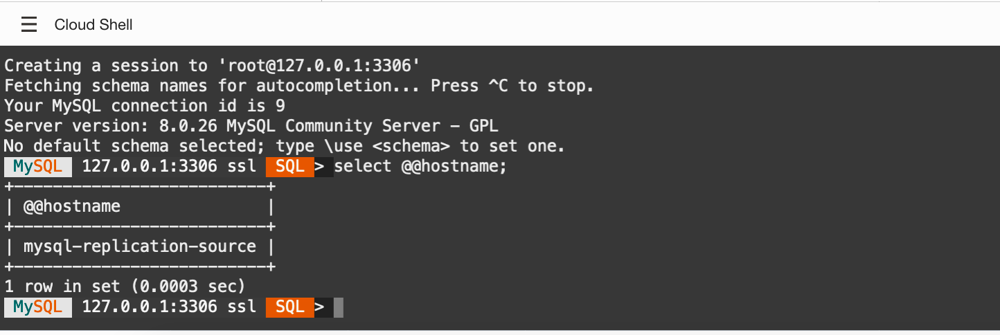

### **Step 4.20:**
- 次のコマンドを実行して、MySQLシェルを終了します :
```
\exit
```
- _**注意**_ MySQLルーターインスタンスへのssh接続は閉じないでください
- クラウドシェルをアイコンに縮小し、次のラボに進みます


## Conclusion
このラボでは、パブリックインターネット接続を備えたコンピューティングインスタンスにMySQLルーターをデプロイして構成し、MySQLソースインスタンスをポイントしました。
これで、次の最後のラボに進むことができます。 

Learn more about **[MySQL Router](https://www.mysql.com/it/products/enterprise/router.html)**


**[<< Go to Lab 3](../Lab3/RADME.md)** | **[Home](/README.md)** | **[Go to Lab 5 >>](../Lab5/README.md)**
