# Lab 5: MDSへのReplication


## Key Objectives:
- インバウンドレプリケーションを使用するためにOCIでMySQLデータベースサービスレプリケーションチャネルを作成する方法を学習します
- レプリケーションのステータスを確認する方法を学ぶ 

## Introduction

このラボでは、MySQLデータベースサービスインスタンスのインバウンドレプリケーションを設定します。

レプリケーションを使用すると、1つのMySQLデータベースサーバー（ソースと呼ばれる）からのデータを1つ以上のMySQLデータベースサーバー（レプリカと呼ばれる）にコピーできます。 レプリケーションはデフォルトで非同期です。 ソースから更新を受信するために、レプリカを永続的に接続する必要はありません。 In this lab you will set up inbound replication for your MySQL Database Service instance.

**[MySQL Replication Overview](https://dev.mysql.com/doc/refman/8.0/en/replication.html)**

OCIでは、インバウンドレプリケーションには、MySQLデータベースサービスで構成されたレプリケーションチャネルが必要であり、正しく構成されたMySQLソースをDBシステムターゲットに接続します。 

**[MySQL Database Service Inbound Replication Overview](https://docs.oracle.com/en-us/iaas/mysql-database/doc/replication.html)**

**Please Note:** MySQLデータベースサービスインスタンスはパブリックインターネットに直接接続されていないため、レプリケーションチャネルを構成するときは、レプリケーションソースとして**MySQL Router Private Hostname**を使用します。 


## Steps

### **Step 5.1:**
- 左上隅のメインメニューから _**データベース >> Channels** を選択します 

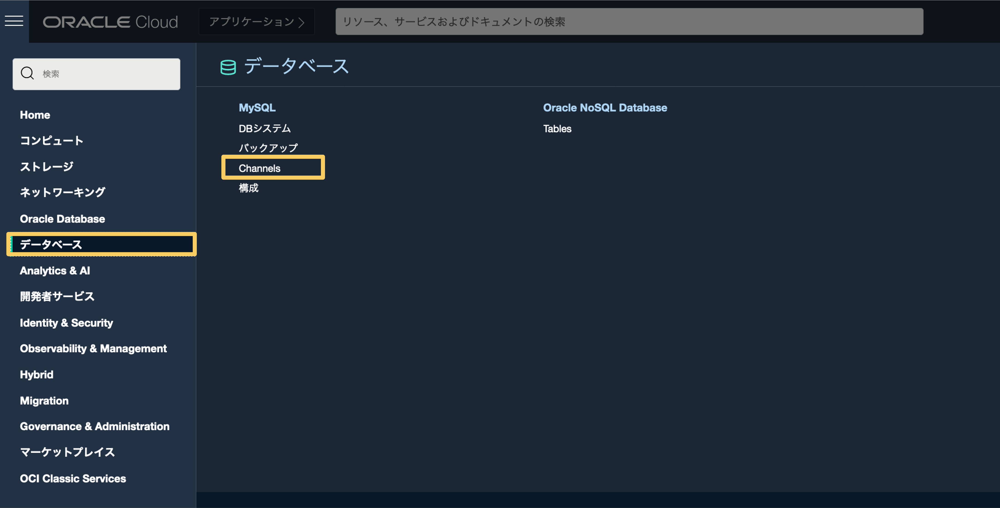

### **Step 5.2:**
- _**チャネルの作成**_ をクリック

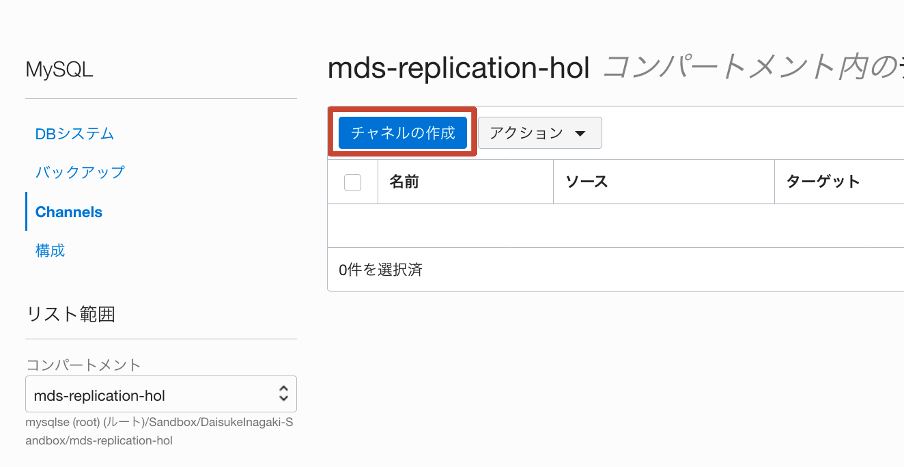

### **Step 5.3:**
-　_**コンパートメントに作成**_　ドロップダウンリストに、これまで使用していたのと同じコンパートメント名が表示されていることを確認します（　_**mds-replication-hol**_ ）
- デフォルトの _**名前**_ のままにします（必要に応じて変更することもできます） 

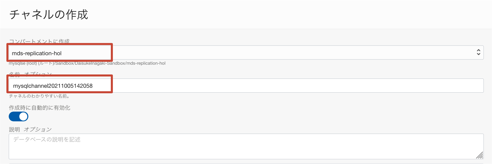

### **Step 5.4:**
- _**ソース接続**_ セクションでは、MySQLソースインスタンスでレプリケーションを設定するためのパラメータを設定できます。 
- _**注意**_: はじめに述べたように、MySQLデータベースサービスDBシステムはインターネットに直接アクセスできないため、_**内部FQDN**_ を _**ソースホスト名**_ として使用します。
次の図のように、MySQLルーターのコンピューティングインスタンスの詳細ページ（ _**メインメニュー>>コンピューティング>>インスタンス>> MySQLルーターインスタンスをクリック**_ ）から取得できます。 

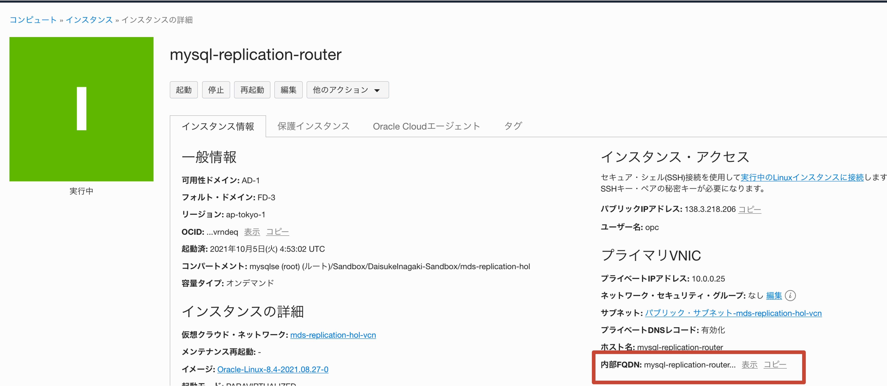

- _**MySQLルーターの内部FQDN**_　を取得したら、_**ソース接続**_　入力フィールドに次の値を入力します（次の図を参照） : 
	- Hostname: _**MySQL Router Internal FQDN**_ 
	- Port: _**3306**_
	- Username: _**root**_
	- Password: _**Oracle.123**_
	- Confirm Password: _**Oralce.123**_

- _**SSL Mode**_　サブセクションで、ボックス　_**無効（DISABLED）**_　を選択します

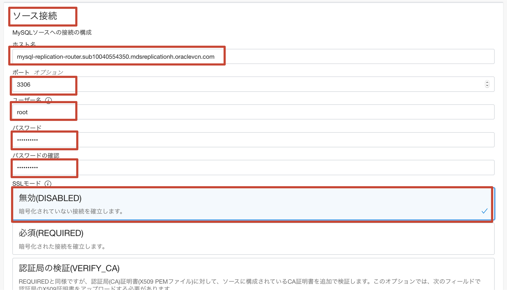

_**注意**_: これはラボ環境であるため、簡単にするために、レプリケーションチャネルの暗号化を無効にしました。 実際の環境（本番環境、テスト環境、開発環境など）でMySQLデータベースサービスレプリケーションチャネルを構成する場合は、_**常に**_ _**SSLモード**_ を _ **必須（REQUIRED）** _ に設定する必要があります。

### **Step 5.5:**
-　_**ターゲット**_　セクションでは、_**Replica**_　として選択する　_**MySQL Database Service DB System**_　を選択できます。

-　_**Applier ユーザ名**_ 入力ボックスに _**admin**_ と入力します。 _**channel名**_ はデフォルトのままにしておきます。

- サブセクション _**DBシステムの選択**_ に _**DBシステムが選択されていません**_ と表示されている場合は、_**DBシステムの選択**_ ボタンをクリックします。

- サブセクション _**DBシステムの選択**_ に以前に作成されたMySQLデータベースサービスインスタンスが表示されている場合は、ステップ5.7に進みます。 

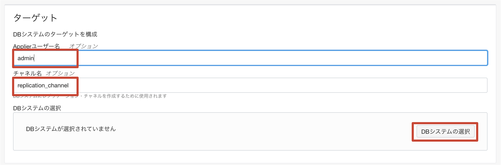

### **Step 5.6:**
- ウィンドウ _**DBシステムの選択**_ で、以前に作成した _**mds-replication-hol-replica**_ を選択し、_**DBシステムの選択**_ ボタンをクリックします

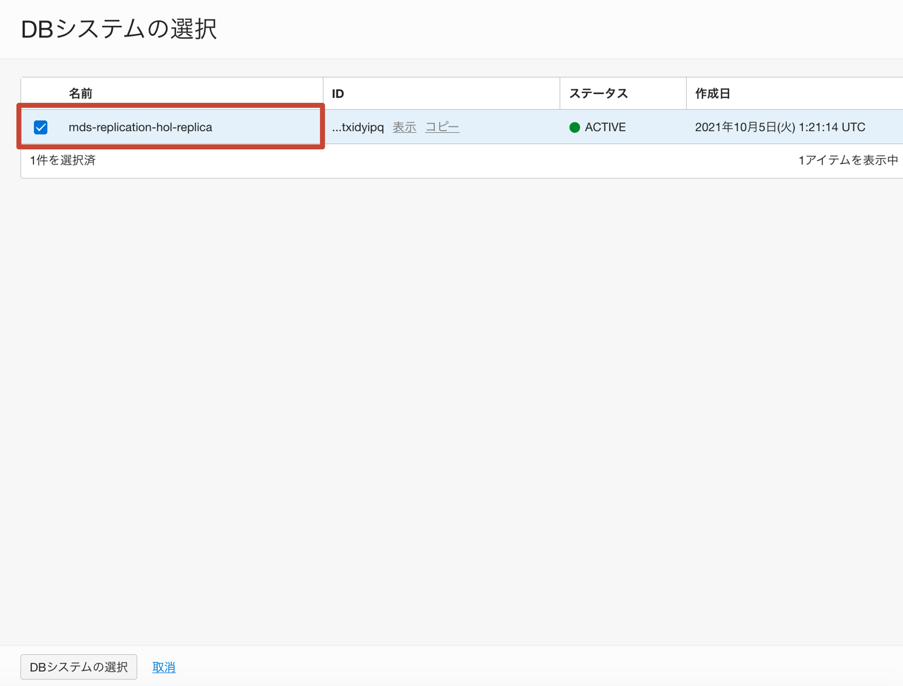

### **Step 5.7:**
- _**チャネルの作成**_ をクリック

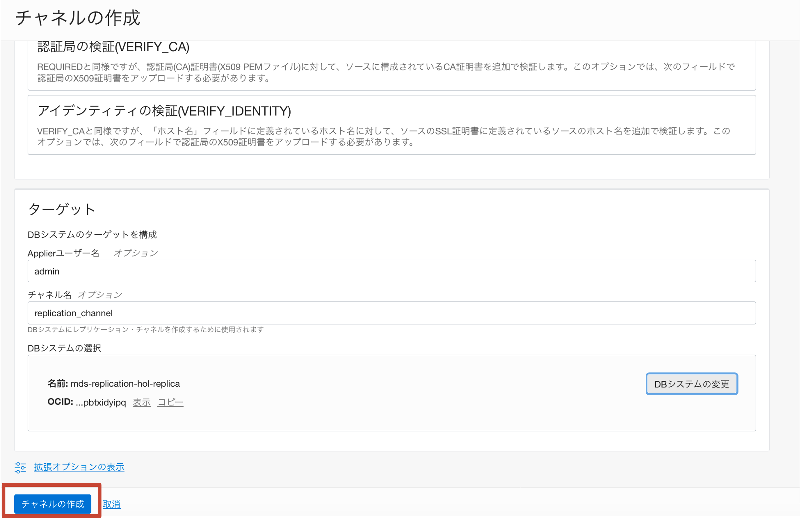

### **Step 5.8:**
- これまでのすべての手順を正しく実行すると、レプリケーションチャネルは問題なくプロビジョニングされ、_**アクティブ**_ 状態になります。 

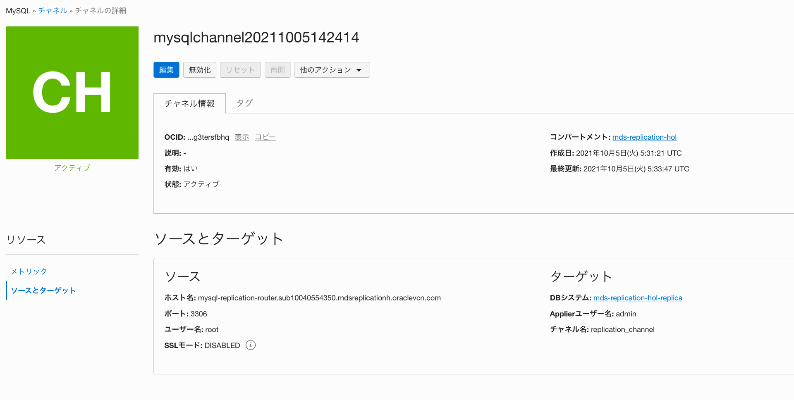

- _**Congratulations!! MySQLデータベースサービスを使用して、レプリケートされた環境を正常にセットアップできました!!**_ 
次のいくつかの手順では、すべてが期待どおりに機能することを確認し、レプリケーションの動作を確認します。 

### **Step 5.9:**
- Go back to the Cloud Shell, which should still be connected the _**mysql-replication-router**_ instance
- From the _**mysql-replication-router**_ instance you will now access the _**MySQL Database Service Replica Instance**_ over the _**Private IP Address**_, to check that the content from the _**Replication Source**_ has been correctly replicated.

_**PLEASE NOTE**_: In order to connect to _**MySQL Database Service**_ we will use its _**Private IP**_. You can retrieve the _**MySQL Database Service  Private IP Address**_ from the MySQL Database Service DB System details page (_**Main Menu >> Databases >> (MySQL) DB Systems >> click on the MySQL Database Service DB System**_), as per below picture:

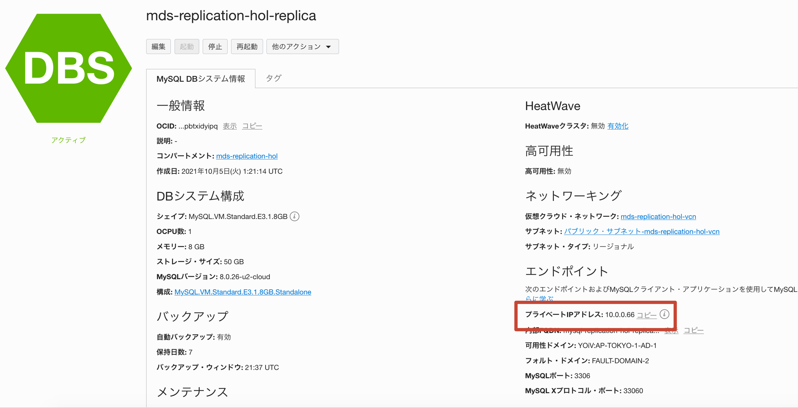

To connect to the _**MySQL Database Service Replica Instance**_ and list existing schemas, execute the following commands:
```
mysqlsh --uri admin:Oracle.123@<mds-private-ip>:3306 --sql
show databases;
```
- You should see the _**world_x**_ schema, as in the picture below.

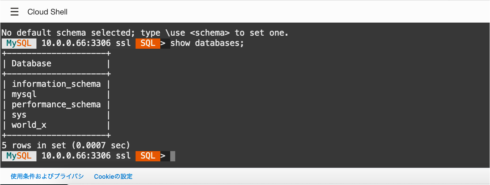

- _**Optional**_: Execute the command
```
SHOW REPLICA STATUS\G
```
The output should look as follows:

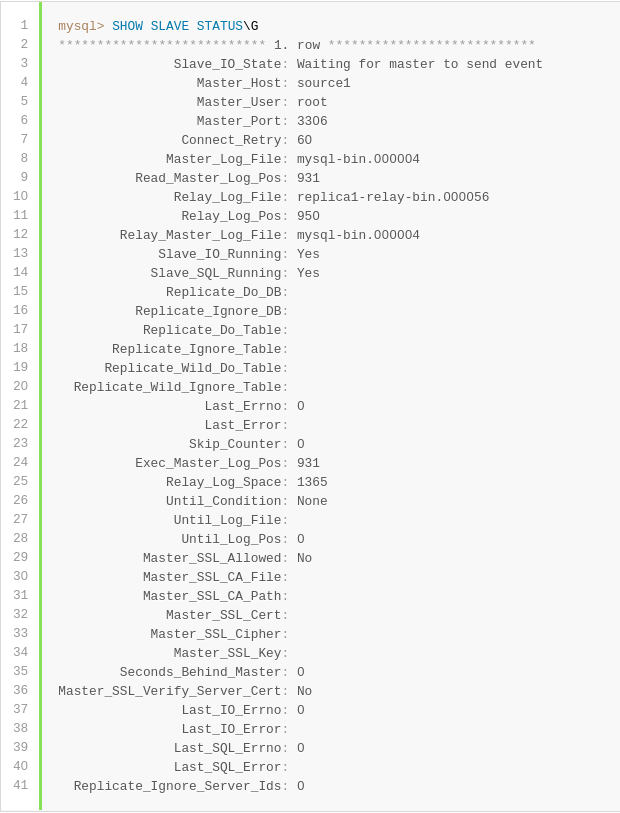

_**Additional Explanation**_: If replication is working correctly you will see the _**Slave/Replica_IO_State**_ field marked as _**Waiting for master to send event**_ and the _**Last_Error**_ field marked empty.
In case of errors in the replication, the _**Last_Error**_ field will contain an explanation of the error, which is going to be useful for troubleshooting.

### **Step 5.10:**
- Exit the MySQL Shell connection to _**MySQL Database Service**_ typing:
```
\exit
```

### **Step 5.11:**
- You will now connect to the _**MySQL Replication Source**_ over the _**Public IP Addrees**_ and create a dummy database.

_**PLEASE NOTE**_: In order to connect to _**MySQL Replication Source**_ we will use its _**Public IP Addrees**_. You can retrieve the _**Replication Source  Public IP Address**_ from the Replication Source Compute Instance details page (_**Main Menu >> Database >> (MySQL) DB Systems>> click on the Replication Source instance**_), as per below picture:

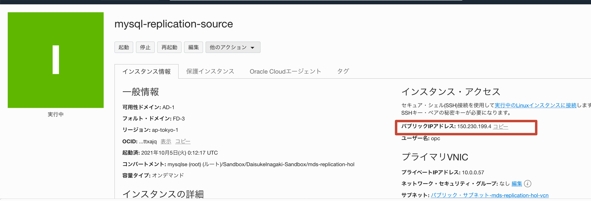

- To connect to the _**MySQL Replication Source**_ and create a new schema, execute the commands:
```
mysqlsh --uri root:Oracle.123@<source-public-ip>:3306 --sql
```
- After you have connected to the _**MySQL Replication Source**_, execute the following command:
```
select @@hostname;
```
...and make sure that the resulting hostname is _**mysql-replication-source**_.
This additional check is done in order to make you sure you are connected to the right host, since we are about to write data. Writing data by mistake into the replication source would cause replication to break!

- Once you have checked that you are connected to the right host, execute the following commands:
```
create database test;
\exit
```

### **Step 5.12:**
- レプリケーションの動作を確認します！ _**プライベートIPアドレス**_　を介して　_**MySQLデータベースサービスレプリカインスタンス**_　に接続し、スキーマのリストを再度確認します

_**注意**_: _**MySQL Database Service**_ に接続するために、その _**プライベートIP**_　を使用します。 _**MySQLデータベースサービスのプライベートIPアドレス**_　は、MySQLデータベースサービスのDBシステムの詳細ページから取得できます（　_**メインメニュー>>コンピューティング>>インスタンス>> MySQLデータベースサービスのDBシステムをクリックします**_ ）


_**MySQL DatabaseServiceレプリカインスタンス**_　に再度接続し、以前に作成したスキーマが正常に複製されたかどうかを確認するには、次のコマンドを実行します
commands:
```
mysqlsh --uri admin:Oracle.123@<mds-private-ip>:3306 --sql
show databases;
```
結果は次の画像のようになります
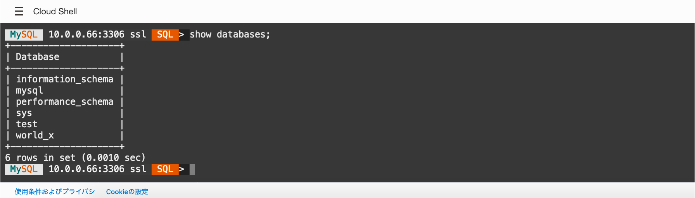

## Conclusion

この最後のラボでは、レプリケーションチャネルを正常に作成し、ソースインスタンスからデータをレプリケートしました。 !!

Learn more about **[MySQL Replication](https://dev.mysql.com/doc/refman/8.0/en/replication.html)**
Learn more about **[MySQL Database Service Inbound Replication](https://docs.oracle.com/en-us/iaas/mysql-database/doc/replication.html)**

## Great Work - All Done!

**[<< Go to Lab 4](../Lab4/README.md)** | **[Home](/README.md)**
